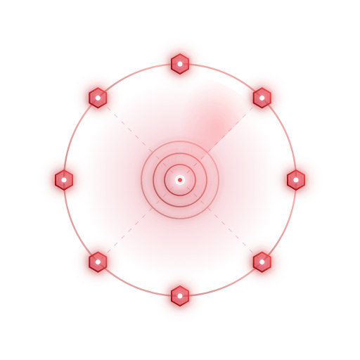

<p align="center">
  
  <h1 align="center">cyber-harness</h1>
  <p align="center">An everything-is-an-extension agent harness for cybersecurity</p>
</p>

<p align="center">
  <a href="https://github.com/chainreactors/cyber-harness/releases"></a>
  <a href="https://github.com/chainreactors/cyber-harness/actions/workflows/ci.yml"></a>
  <a href="https://github.com/chainreactors/cyber-harness/releases"></a>
  <a href="https://github.com/chainreactors/cyber-harness/blob/master/LICENSE"></a>
  <a href="https://github.com/chainreactors/cyber-harness/stargazers"></a>
</p>

<p align="center">
  <a href="README_CN.md">中文文档</a>
</p>

---

cyber-harness is an agent runtime for cybersecurity. Model reasoning, tool execution, knowledge, observation, and collaboration are assembled through the same extension lifecycle. Use the reference distribution or compose the capabilities your own Go application needs.

`aiscan` packages the agent, core scanners, proxy routing, skills, and IOA collaboration. `aiscan-full` adds the Web workbench, browser automation, passive recon, and deep crawling.

> Use only on explicitly authorized targets.

## Start here

Download the matching `aiscan` or `aiscan-full` archive from [GitHub Releases](https://github.com/chainreactors/cyber-harness/releases/latest), extract it, and add the executable to PATH. See [Getting started (中文)](docs/getting-started.md) for installation, PowerShell configuration, and a complete first run.

```sh
# With an LLM configured: run a local task and save its events
aiscan agent -p "Read the current directory and explain its structure; do not modify files" -o first-run.jsonl

# Run a deterministic scan against your own local lab, without AI verification
aiscan scan -i http://127.0.0.1:3000 --verify=off

# Full edition: start the Web workbench and sign in with the printed access key
aiscan-full web
```

The agent lets the model choose tool calls. The scan pipeline chooses work through rules and scan events, with optional AI stages. Both use the same underlying tool infrastructure.

## Configure a model

Create `cyber.yaml` in your working directory:

```yaml
llm:
  provider: openai
  base_url: https://api.deepseek.com/v1
  model: deepseek-chat
```

Set `OPENAI_API_KEY` to your credential. For Anthropic-compatible services, use `provider: anthropic` and the corresponding settings. See the [configuration reference](docs/reference.md) for protocols, profiles, and precedence.

## Documentation

Start at the [documentation home](docs/README.md). Detailed documentation is maintained in Chinese and describes the current source; use the matching Git tag for a release.

[Concepts](docs/concepts.md) introduces the harness, models, tools, sessions, and knowledge, without requiring Go experience.

The [user guide](docs/user/README.md) progresses from installation and a first task to sessions, tools, Skills, scanning, and collaboration.

The [developer guide](docs/development.md) builds an application in Go, starting with a runnable tool and then an embedded session, extensions, and host integration.

[Architecture](docs/architecture.md) explains composition and lifetime, the Agent loop, execution, context, and data flow. Configuration and API details remain in the [reference](docs/reference.md).

## Build and embed

```sh
git clone --recurse-submodules https://github.com/chainreactors/cyber-harness.git
cd cyber-harness
make          # standard distribution
make agent    # minimal local agent
make full     # frontend + full distribution
```

Use the Go version declared in [go.mod](go.mod). Full builds also need Node.js/npm; standard and full builds use CGO_ENABLED=0. Build tags are defined in [editions.env](editions.env); native recording requires CGO and is a separate [record build](docs/record.md).

For custom distributions, call `harness.BaseExtensions(config)`, append your extensions, and pass them to `extension.New`. The host owns Load/Close. The reference distribution is assembled in [cmd/aiscan](cmd/aiscan). Embedders can use [pkg/harness](pkg/harness) for a generic host, or compose their own extensions; it does not reproduce the complete aiscan distribution. See the runnable [custom example](examples/custom) and the [extension development guide](docs/development.md).

## Contributing

Read the [development guide](docs/development.md) and [documentation standards](docs/maintaining-docs.md). Describe the behavior change, affected entry points, and validation in your PR. Update the relevant guide or reference with behavior changes.

## Disclaimer

1. This tool is intended for **authorized security testing and research purposes only**. If you need to test its capabilities, please set up your own lab environment.
2. Before using this tool for any scanning, you must ensure compliance with local laws and regulations and obtain **sufficient authorization. Do not scan unauthorized targets.**
3. If you engage in any illegal activity while using this tool, you shall bear all consequences yourself. We assume no legal or joint liability.
4. Before installing and using this tool, please **carefully read and fully understand all terms**. Limitation and disclaimer clauses may be highlighted for your attention.
5. Unless you have fully read, understood, and accepted all terms of this agreement, please do not install or use this tool. Your use or any other express or implied acceptance constitutes your agreement to be bound by these terms.

## License

This project is licensed under the [GNU Affero General Public License v3.0 (AGPL-3.0)](LICENSE).

## Links

- [chainreactors](https://github.com/chainreactors) — Organization
- [IOA](https://github.com/chainreactors/ioa) — Internet of Agents
- [sdk](https://github.com/chainreactors/sdk) — Scanner SDK
- [proxyclient](https://github.com/chainreactors/proxyclient) — Multi-protocol proxy client
- [crtm](https://github.com/chainreactors/crtm) — Security tool package registry
- [utils](https://github.com/chainreactors/utils) — Shared utilities & PTY manager
- [parsers](https://github.com/chainreactors/parsers) — Protocol & data parsers

---

<p align="center">
  <a href="https://star-history.com/#chainreactors/cyber-harness&Date">
    
  </a>
</p>
