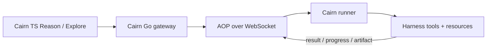
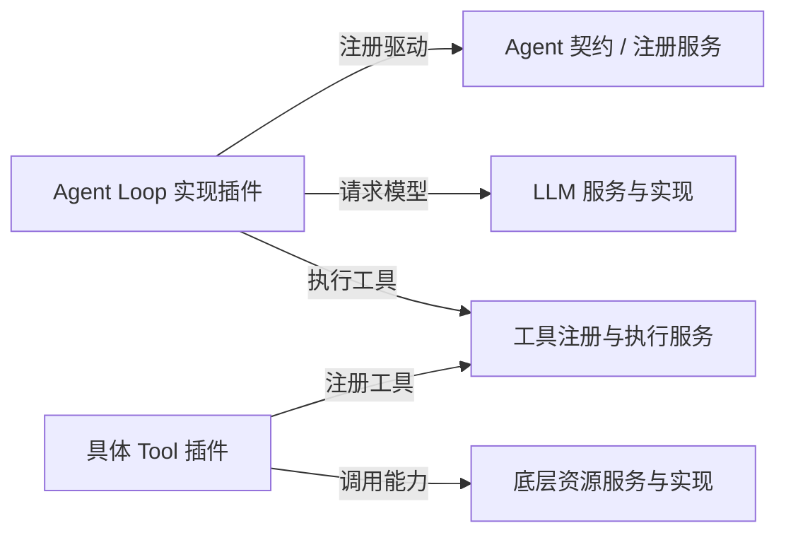
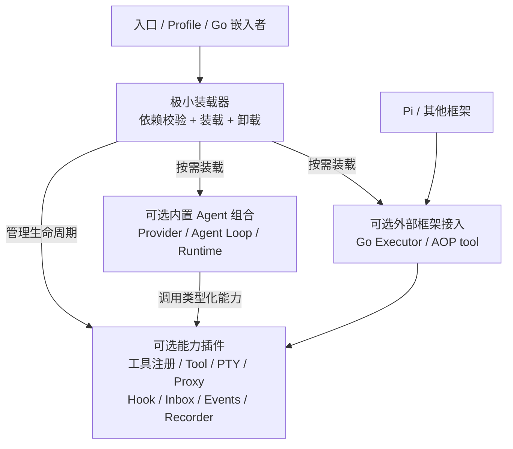

# 无 Agent 的 Cyber Harness：统一装载与插拔方案

状态：方案 V2；已实现独立的 [通用生命周期底座](../core/plugin/README.md)，尚未接入产品路径，整体未完成验收。评审入口：[Issue #125](https://github.com/chainreactors/cyber-harness/issues/125)。
本版替代 V1 的 App/Session 中心方案。**Cyber Harness 是独立的能力层，内置 Agent 是可选消费者。**
当前工作区仍有其他包迁移，实施按符号核对源码，不将本文目标当成现有实现。

## 1. 必须成立的产品形态

| 形态 | 装载内容 | 边界 |
| --- | --- | --- |
| Go 工具库 | 工具注册与选定工具，按需装载资源和工具 Hook | 不创建 App/AgentRuntime，不导入 Agent Loop，不要求模型配置 |
| 独立工具进程 | 工具库 + AOP tool 入口 + stdio Host | 不创建虚假 Session/Turn，工具调用以 CallID 关联 |
| 外部框架工具层 | 外部框架适配 + 工具库或工具进程 | Pi/其他框架拥有推理、历史、重试与调度，Harness 不启动第二套 Agent |
| 内置 Agent 产品 | 相同工具能力 + Provider/Agent Loop/Runtime，以及所需 Inbox/Skills/展示 | Agent 组合卸载后，独立使用的工具能力仍可保持运行 |

本仓库的 `agent.Agent` 与外部 Pi 框架是两个概念。历史文档称本地内核为 PiAgent，不代表它来自外部 Pi SDK。
关闭 Provider 不能证明无 Agent：需要同时验证构造副作用与生产依赖闭包。

## 2. DSH 的实际参考

静态核对 `refer/deepseek-harness` 提交 `b2e3b2a0125854567a4a5fcba75782e42fe84901`，未运行 DSH：

- 工具注册、模型适配、会话服务、Agent Loop 都是插件，profile 从空集合组成产品。
- 插件通过 inject 声明依赖，注册是可撤销 effect，卸载回收所属注册和资源。
- web profile 支持 live reload；headless/sdk 等入口在启动时固定配置，不是所有入口都默认热更新。
- 部分工具仍引用 Agent 类型；全插件不自动意味着无 Agent，我们须独立验证工具层的依赖。

参考：[DSH 架构](https://github.com/deepseek-ai/deepseek-harness/blob/b2e3b2a0125854567a4a5fcba75782e42fe84901/docs/architecture.md)、[Cordis 基础](https://github.com/deepseek-ai/deepseek-harness/blob/b2e3b2a0125854567a4a5fcba75782e42fe84901/docs/cordis-primer.md)。
采用统一装载、依赖和撤销语义；Go 中保留明确构造依赖，不复制动态 Context 服务查找和任意表达式配置。

### DSH 的大体系：同一插件底座上的不同能力域

DSH 官方按数十个 package group 组织代码。为本次架构评审，可按职责归纳为以下八组；这不是官方固定的“八大体系”命名。

| 体系 | DSH 的主要包/服务 | 职责 |
| --- | --- | --- |
| 装载与组合 | Cordis、boot、bundle、profile/preset、extensions | 插件实例、依赖、作用域、配置组合及撤销 |
| Agent 服务与驱动 | core/agent 的 ctx.agents；core/agent-loop 的 ctx.agentLoop | Agent 契约/注册与具体默认循环分离，Loop 作为可替换 factory/driver 接入 |
| 工具体系 | core/tools 的 ctx.tools；各 tool-* 消费者 | 工具定义、注册、发现、执行及 tools/* 前后置流程 |
| 模型体系 | llm/llm、llm-deepseek、llm-pi-ai | 模型契约、路由与具体 Provider 实现，不拥有工具运行 |
| 底层执行与资源 | fs、shell、subprocess、terminal、sandbox、web、code-runtime | 文件、进程、终端等能力契约和实现，工具通过这些服务使用能力 |
| 会话与上下文 | core/session、session、system-prompt、context、compaction、skill | 历史、持久化、模型可见上下文及 Skill；与某个具体 Loop 实现分开 |
| 后台任务与协作 | jobs、subagent、schedule、workflow | 实际长任务及委派能力，各自提供服务和可选 tool-* 入口 |
| 接入与平台支撑 | api/sdk/acp、host/client、settings、credentials、storage、interaction | 接入、界面、配置、存储和用户交互 |

**Agent Loop 与工具是两个能力体系，共用 Cordis 插件体系。** 更细分时，Agent 契约/服务、具体 Loop、工具执行服务是三个独立角色。
`dsh-agent` 在没有 driver factory 时不会发模型请求；`dsh-agent-loop` 注册默认 driver。
源码中 AgentLoop.inject 包含 agents、sessions、llm、tools、systemPrompt、sessionProjections；ToolRuntime.inject 是 systemPrompt，不依赖具体 agent-loop。
工具包仍可能使用 Agent 类型或作用域，因此不能从“未依赖 agent-loop”推导出“完全无 Agent 契约”。

### Cairn runner：真实的无 Agent 消费者

`../cairn-platform` 的 runner 是本方案的实际外部消费者样例。参考仓库当前提交为
[`9a5952b7`](https://github.com/oritera/cairn-platform/tree/9a5952b7cd8cba091599a53786a4b533d10dbb30)，其
`runner/go.mod` 固定使用旧版 Harness `fddd243d8947`。调用链是：



runner 的 `runtime.run` 只解析配置、初始化工具注册表和资源，然后调用
`node.RunToolNode(ctx, node.ToolNodeConfig{...})`；它没有创建 Harness Agent、Agent Loop、TUI、Web 或模型会话。
`SessionID`/`TurnID` 如果由上游提供只能作为关联字段，不能在 runner 内部制造本地 Agent 生命周期；Cairn 继续拥有
Reason、Explore、任务重试、事实归因和 runner 所有权策略。

这也是当前实现与目标之间的可测差距：该 runner 在业务角色上已经是 tool-only，但旧版包依赖闭包仍包含
`agent/tmux`、`agent/hooks`、`agent/inbox`、`agent/provider`、`agent`、`agent/evaluator`、`agent/probe`、
`pkg/runtime`、`pkg/node` 和 `pkg/tui`。这是 `go list -deps` 的源码/构建包闭包检查，不等于每个符号最终都会进入链接器产物，
也不是已经通过新架构验收。迁移目标是让同样的 runner 只依赖工具注册/执行、必要资源和中立 AOP 处理；
不得以“没有调用 Agent”掩盖包级依赖。

因此必须分开三个边界：

1. **工具运行时**：注册、调用、Hook、取消、进度、结构化结果和资源所有权；不导入 Agent Loop 或产品 App。
2. **AOP 接入**：把已有工具调用映射到协议命名空间；不拥有 WebSocket、stdio 或任务调度。
3. **传输载体**：Cairn 自己管理 WebSocket，独立工具进程可使用 stdio；两者都不应再包一层强制 Host。

`pkg/node` 目前把 AOP、WebSocket 重连和部分旧 Runtime 类型放在同一入口，属于迁移中的历史耦合；目标不是把 Cairn 的
清理回调、领域策略或连接管理复制进核心，而是提供可由 Cairn 直接装配的中立 AOP tool handler。Cairn 的现有
重连身份测试（`runner/internal/runtime/transport_integration_test.go`）应作为后续真实验收：保持 `CallID`、取消、进度、
artifact、结构化错误以及重连时稳定的 runner instance identity。



DSH 常用“服务契约 → 具体实现 → tool-* 消费者”组织一个能力族。例如 shell 服务、具体 shell executor、tool-bash 是不同角色。
每个角色都经同一个插件底座装载；插件身份不等于 Tool 身份，工具也不拥有它使用的全部底层资源。
本项目采用这个职责区分；仅当替换需求实际存在时提炼稳定契约，不能机械地为每个函数建立三个包。

源码依据：[Agent 服务](https://github.com/deepseek-ai/deepseek-harness/blob/b2e3b2a0125854567a4a5fcba75782e42fe84901/packages/core/agent/README.md)、[Agent Loop](https://github.com/deepseek-ai/deepseek-harness/blob/b2e3b2a0125854567a4a5fcba75782e42fe84901/packages/core/agent-loop/src/index.ts)、[ToolRuntime](https://github.com/deepseek-ai/deepseek-harness/blob/b2e3b2a0125854567a4a5fcba75782e42fe84901/packages/core/tools/src/index.ts)、[package 分组](https://github.com/deepseek-ai/deepseek-harness/blob/b2e3b2a0125854567a4a5fcba75782e42fe84901/packages/README.md)。

## 3. 目标架构



装载器不保存 Provider/Tools/Inbox/Session/App 字段，不进入工具调用热路径，也不提供通用 Invoke。
加载后的消费者直接使用构造时传入的具体对象或既有能力契约。能力包不反向导入内置 Agent。
空 profile 只有配置解析、模块身份、依赖校验与生命周期控制，不创建业务队列、客户端、监听或工具。

## 4. 统一装载契约

`core/plugin` 已提供以下生命周期 API；实例由构造函数显式注入依赖。当前 Entry 集合固定，空 Load 选择不装载模块；产品装配和注册撤销仍属于后续工作：

```go
// Module 只统一真实实例的生命周期。
type Module interface {
    Load(context.Context) error
    Close(context.Context) error
}

type Entry struct {
    Descriptor capability.Descriptor
    Module     Module
}

// Descriptor 增加 DependsOn []capability.ID，指向本 Set 的模块 ID。
// New(entries ...Entry) (*Set, error)
// (*Set).Load(ctx context.Context, ids ...capability.ID) error
// (*Set).Unload(ctx context.Context, id capability.ID) error
// (*Set).Close(ctx context.Context) error
```

必要性：同一个装载器必须启动、回收失败和卸载不同机制，不能继续逐个判断工具/代理/Agent 的具体类型。
Module 只有两个生命周期方法，替代分散的 Factory 执行和关闭约定，不增加 Execute、OnEvent、Sink 或 DTO。
Entry 是唯一装配定义，绑定现有 Descriptor 与真实实例；Set 保存实例生命周期和依赖，不复制业务结果或状态。
具体资源能自行实现契约时直接实现；多个出口的组合插件保存其真实资源及注册归属，不创建仅转发两方法的包装对象。

### 构造和依赖

- 一个 Set 内 ID 唯一，一个 Module 实例只属于一个 Entry/Set。多个 profile 使用不同实例，禁止可变全局插件状态。
- 构造函数只保存配置和具体依赖；副作用从 Load 开始。完成 Close 的实例不能再次 Load，重装必须构造新实例。
- profile 解析模块自身的类型化 Config 并构造 Entry。第三方 Go 扩展通过 profile/catalog 增加装配声明，不修改装载器、Agent Loop、Runtime 或 Host。
- 依赖通过构造参数直接传入。DependsOn 只约束顺序和卸载，不用于查找或注入对象；不提供 GetService/Get[T]/ModuleContext/Bag。
- 配置展开所选模块的依赖闭包；显式禁用必需依赖、缺失依赖、依赖环、重复 ID 均在副作用前失败。
- 稳定拓扑顺序装载，逆序关闭；已 active 的依赖复用。构造参数与声明边的一致性由模块装配测试校验，不用反射推断。
- 原 Descriptor.Requires 是缺失依赖诊断文本，不能冒充依赖图；迁移后由 DependsOn 与具体构造错误替代。
- capability 保留编入能力的描述与选择；实际实例以 Set、实际出口以注册表为准。删除独立追加式 Factory 列表，不保留两份装配权威。

统一插件协议并不要求统一所有构造参数。profile 允许写具体构造关系；任意 Go 类型不能只靠 YAML 获得未知依赖。
这项取舍需要在评审中确认，不能一边禁止依赖容器，一边承诺自动注入任意服务。

## 5. 插拔与代码分发

目标包含启动选择与显式运行中 Load/Unload。首个插件必须验证真实卸载，不能永久以“下次启动不创建”代替。

| 场景 | 确定行为 |
| --- | --- |
| 已编入模块 | 配置选择、Load/Unload 均可；不需要先创建 Agent 产品 |
| 自定义 Go 扩展 | 与嵌入者或发行 profile 一起编译，使用同一契约；只改装配声明，不改产品核心 |
| 卸载有依赖者的模块 | 返回依赖占用错误且不改变状态；先显式卸载依赖者，再卸载资源 |
| 替换服务 | 停止受影响入口，卸载依赖者和旧资源，构造新依赖闭包后装载；不替换仍在借用的指针 |
| 未编入的外部工具 | 通过已装载的协议客户端接入独立工具进程；限于既有协议可表达的能力，不冒充进程内 Hook 注入 |
| 单文件分发 | 内置模块静态链接、按需装载；禁用不等于未链接。无 Agent 精简产物单独验证构建闭包 |

不把 Go plugin.Open 作为跨平台必选方案。独立外部进程需要额外可执行文件，须明确其分发要求。
自动配置监听和无中断替换不是 Load/Unload 的隐含承诺；不支持的跨进程能力应单独评审协议，不增加万能 Invoke 或传输 DTO。

## 6. 生命周期与可撤销注册

实例状态只保留 `new → loading → active → stopping → closed`，错误附着在同一实例，不另建 PluginState DTO。
Set 的拓扑事务串行；业务执行不持有拓扑锁。

1. Load 校验整个集合，依赖先装载。模块内部资源准备好后才发布出口，只有 Load 成功才可被依赖者使用。
2. 新组合的外部入口最后装载。首版不承诺对既有观察者提供跨多个注册表的原子快照；依赖该能力的组合需停止入口后更新。
3. Load 失败时先 Close 失败模块，回收部分初始化，再逆序关闭本次新装载实例；原本 active 的模块不受影响。
4. Close 先撤下调用准入和发现出口，再取消并等待已接受工作，最后撤销订阅、释放资源。借用者不能关闭依赖资源。
5. 请求取消只影响该次调用；已返回的后台任务必须交给显式拥有其生命周期的资源管理者，没有拥有者就不能暗中转后台。
6. Close 超时不代表卸载完成：保留 stopping、模块 ID 和依赖占用；再次 Close 可继续等待，不能提前发布替代实例。
7. 关闭失败保留未结束实例及其依赖，报告错误；只能继续回收与之无关的资源，不能把失败当成功。

Module 实现关闭自己的资源，Set 只控制依赖顺序和状态。不能用 goroutine 包住无法停止的旧 Close，假装实现了可超时回收。

Tool/Command 注册必须带模块 owner ID，同名默认失败，撤销只能影响实际 owner 的出口。
执行取得注册项时同步通过关闭准入并计入在途工作；撤下入口后新调用失败，在途调用仍返回明确完成或取消结果。
发现返回已有工具定义，执行走已有 Executor，不向外泄漏可长期绕过准入的裸工具引用。

Hook 注销只阻止后续快照纳入，不代表在途 handler 结束；具体插件保存已有 unsubscribe 并等待自身工作。
删除 CommandRegistry 静默覆盖、Factory 追加、App 扫描工具类型关闭、Command.Close 再关闭同一资源等分散约定。
不新建通用 effect/cleanup 回调包，也不使用 EventBus/Sink 传递执行结果。

## 7. 各机制的拆解与切入点

| 机制 | 无 Agent 部分和插件入口 | Agent 专属绑定 |
| --- | --- | --- |
| Tool | core/tool 契约、可装载的工具注册服务、具体工具注册/撤销；原有 AOP 定义与结果 | 模型如何选择工具属于 Agent Loop |
| tmux/PTY | 具体进程/终端管理独立 Load/Close；bash、终端命令借用同一资源 | 完成通知进入 Agent Inbox 的消费绑定 |
| proxy | 具体资源插件与命令/协议消费者分开；不装载不监听，关闭者唯一 | 与 Agent 任务的展示关联留在接入层 |
| Inbox | 消息、容量、Push/Drain、producer 完成契约无 Agent；有界实现独立装载，可由既有 Inbox 契约替换 | 自动唤醒、steer、turn 消费和 Run 调度留 Runtime |
| Hook | 通用类型化注册独立装载；工具 Hook 在工具执行服务生效，纯工具模式也执行 | BeforeRun、模型上下文、compaction 等点属于 Agent 插件 |
| subagent | 可选委派工具按框架分别装配，使用 Tool 契约；未装载对应框架时无该出口 | 本地派生、历史、父子调度只在本地框架插件，不强造通用 Agent DTO |
| Provider | 模型 API 契约与实现可独立装载；普通工具不导入它 | Agent Loop 借用所选 Provider |
| Skills | 文件/元数据/资源访问可选装载 | Prompt 注入和 Agent 类型选择属于 Agent 组合 |
| Events/Recorder | 原始 AOP 订阅与落盘可选；无 Agent 工具结果仍可返回、记录 | Session/Turn 事件仅由真实 Agent 生命周期生产 |
| Host/Console | inline/stdio 通信、工具 CLI 是可选入口，Host 仅 mux 分发 | Agent REPL 显式依赖 Runtime，不是唯一交互形态 |

Inbox 与 Hook 的实现也可不装载，不再强制由 App/Session 创建。协议定义和消费者语义保持稳定。
替换正在使用的 Inbox 需停止消费者，不能丢弃在途消息后宣称透明切换。

工具调用 Hook 从 Agent Loop 收回工具执行入口：外部调用不能跳过，本地调用不能重复。
沿用实际 CallID、Invocation、AOP ToolCall/ToolResult，Agent 特有上下文不成为必填参数。
现有 hooks.SetErrorSink 从返回错误的消费路径解决，保留合并、短路及失败策略，不能改名恢复 reporter callback bag。

### Agent Loop 必须可以单独替换

仅能装卸整个内置 Agent 产品不够。目标还要求在保持工具、入口和会话控制语义的条件下，替换默认 Loop 实现。

| 角色 | 本项目的目标职责 |
| --- | --- |
| Agent 契约及真实上下文 | 保存消息与配置等真实状态，定义驱动需要的调用边界；不隐式安装默认 Loop |
| 默认 Loop 插件 | 实现模型请求与工具迭代算法，借用选定 Provider、Executor 和相关扩展；其代码从 agent/loop.go 收拢到 agent/loop 实现包 |
| Runtime | 保留 Session/Run 准入、取消、等待和恢复协调，依赖驱动契约，不依赖默认 Loop 包 |
| 工具执行服务 | 独立管理工具调用、Hook 与资源；不由 Loop 构造，也不因卸载一个 Loop 而关闭 |

Agent 层只新增能够替换实际循环所需的最小驱动契约，复用真实上下文、agent.Result 和 AOP 类型；不新造 AgentRequest/AgentResult 镜像。
它与 Module 职责不同：Module 管装载生命周期，驱动契约管执行算法。这个额外契约的必要性由“两种 Loop 使用同一 Runtime 和工具集合”的验收证明。
具体签名在迁移前从 Run/Continue、Reset、MessagesSnapshot、Compact、Provider 更新等实际调用面确定；不能直接把现有 Agent 全部方法复制成一个大 interface。
状态操作留实际状态所有者，压缩等可选能力明确注册自己的入口，禁止用任意 callback bag 或反复类型断言处理可选方法。

同一 Runtime 的新 Session 明确选择一个已装载 driver；已有 Session 固定其驱动，不在 turn 中途替换。
driver 被会话借用时不能完成卸载：先由拥有者关闭/等待会话，再卸载 driver，工具模块保持有效。
恢复必须验证目标 driver 是否接受现有历史语义；不支持时明确报错，不能将任意 Loop 的状态宣称为通用恢复格式。
没有装载 Loop 时，工具路径正常工作；Agent 请求明确不可用，不回退到隐藏默认实现。

## 8. 外部框架 API 边界

Go 消费者直接持有已装载工具注册服务，通过既有 tool.Executor 发现/调用工具，使用 context 和已有 tool.Invocation。
无 Agent 时 SessionID/TurnID 可为空；协议路径继续校验 CallID。不构造假 Session，不填固定 aiscan.agent emitter，不为取工具目录创建 App/Runtime。

pkg/runtime/tool_call.go 的 AOP 工具处理迁到无 Agent 的工具接入包，复用执行、进度、错误和内容处理。
Host 不认识 Module，也不拥有工具。纯工具 profile 只注册已提供的 namespace，未装载的 RunTurn 等 Agent 操作明确不可用。

外部框架拥有模型循环、历史、重试和调度。适配代码归该框架接入包，只转换框架原生类型与既有 AOP/Tool 类型，内部不引入 HarnessResult/PluginEvent。
转换有真实协议差异，必须保留结构化内容、调用关联、取消和错误语义，不能声称完全零转换。
具体 Pi 包名、版本和工具注册 API 在适配实现前固定；DSH 的 pi-ai 模型适配器不是本项目向 Pi 提供工具的现成实现。

## 9. 源码迁移落点

| 当前实现 | 目标与删除内容 |
| --- | --- |
| core/capability + pkg/commands/factory.go | capability 保留描述；新增 core/plugin 统一生命周期。删除追加式 Factory、无错误返回 Build、宽泛 Deps/Bag |
| pkg/commands/command.go | 工具注册与执行迁到无 Agent 的 pkg/toolset；CLI Command 保留自身职责，解除工具注册对 bash/PTY 的导入 |
| pkg/commands/register.go 及内置文件/bash/tmux 工具 | 具体实现进入对应 tools 包，逐模块选择；删除 core 组隐式一起创建所有工具的 init |
| agent/tmux | 资源实现归现有 pkg/terminal；整理别名与事件桥，消费者借用同一具体 Manager |
| agent/inbox | 契约与消息归 core/inbox；有界实现与装载归 pkg/inbox；Runtime 仅保留唤醒/消费调度绑定 |
| agent/hooks | 通用注册归 core/hooks；工具事件归工具领域；Agent 事件留 agent/hooks，全部调用方使用真实定义 |
| agent/provider | 独立模型能力移到 pkg/provider 并按实现拆依赖；纯工具 profile 不导入它 |
| agent/subagent.go | 本地框架工具归可选 Agent 集成包；通用工具库不导入，不隐式安装其他框架执行器 |
| pkg/runtime/tool_call.go | AOP tool 入口归 pkg/toolset，移除固定 Agent emitter、会话必填和模型上下文的默认假设 |
| tools/search 等混合工具 | 无模型后端和 Provider 后端分开装载，单个无模型后端不能传递链接 LLM 实现 |
| tools/scan 的 Agent 引用 | 确定性工具与已有 Agent 依赖组合分开；只迁依赖和所有权，不改变工具业务行为 |
| pkg/app | 各资源字段/初始化归对应模块；最终保留产品 profile 配置和装配，不作为所有能力必经容器 |
| agent/loop.go 与 pkg/runtime | 默认 Loop 拆为可选驱动实现；Runtime 使用最小驱动契约，保留唯一 Session/Run 调度；删除 App 双所有权与资源初始化 |

迁移唯一实现与所有调用方，不保留兼容别名或两套 fallback。不将 commands.Deps 改名 ModuleContext。
产品 profile 可以导入内置 Agent；纯工具嵌入者直接装配工具模块，不依赖该产品预设。

## 10. 按完整路径实施

| 步骤 | 交付 | 验收 |
| --- | --- | --- |
| A：无 Agent 最小路径 | 无副作用示例 Tool、独立工具注册、Executor 直接调用 | 列出/调用/取消正常，依赖闭包无 Agent/Runtime/App/Console/Provider，不需要模型配置 |
| B：真实装载和卸载 | Module/Entry/Set、依赖校验、回滚、归属注册、Unload | 依赖环/冲突/失败回收/在途卸载/超时重等通过，同时移除被替代工厂路径 |
| C：实际工具与资源 | 文件工具、PTY/bash，再迁其他资源；工具 Hook 同步移至工具入口 | 不装载无副作用，借用者不误关资源，外部与内置调用 Hook 一致且仅一次 |
| D：Agent 可选且 Loop 可替换 | Provider/Inbox/Agent 服务/Loop driver/Runtime/Skills/Recorder 按需装载 | 两种受控 Loop 使用同一 Runtime/工具集合；未装载 Loop 时工具仍工作，卸载后无隐藏默认回退 |
| E：外部框架 | AOP tool/stdio 纯工具入口，固定一个框架版本的真实注册示例 | 框架拥有任务循环，类型映射/取消有效，无假 Session 和隐藏本地 Agent |
| F：清理与回归 | 删除 App 特判、旧 Deps/Factory、重复回调与关闭链，更新入口及文档 | 同一插件包用于工具库、工具进程和内置 Agent，无旧 fallback |

每步闭合生产路径，不能只新增接口、空包或演示入口。模块卸载在 B 步完成，不延期到最后。

## 11. 最终验收

- [ ] 空 Set 不创建业务资源；工具注册、PTY、Inbox、Hook、Agent 均可不装载。
- [ ] 最小工具示例 go list -deps 不含 agent/...、pkg/runtime、pkg/app、pkg/console、模型实现及不相关工具。
- [ ] 精简工具进程不需要模型凭据，不产生虚假的 SessionStarted/TurnStarted。
- [ ] 同一无副作用工具经 Go/AOP/外部框架/本地 Agent 获得一致结构化结果、错误和取消语义。
- [ ] 工具 Hook 在无 Agent 路径生效，本地路径不重复；短路和失败策略保持。
- [ ] 两种受控 Loop 实现复用同一 Runtime、工具和入口；替换 driver 不需要改工具注册与协议分发，活跃 Session 不被中途换驱动。
- [ ] 无默认 Loop 的构建组合不传递链接默认实现；无 Agent 的工具组合连 Agent 契约也不依赖。
- [ ] Unload 撤销所属注册并等待在途工作，超时不提前释放依赖或复用 ID。
- [ ] 装配失败只回收本次资源；依赖占用、重复关闭、回滚失败、关闭并发入队都有测试。
- [ ] 两个 Set 和两个执行作用域隔离，Session/Run 私有工作不提升成全局插件状态。
- [ ] 旧 Deps/Factory/SetErrorSink、重复关闭及兼容转发有逐项删除证据。
- [ ] standard/full/精简工具构建、相关 Windows/Linux 测试和 race 有实际记录；已知失败如实记录。

## 12. 评审决策

1. 是否接受两方法 Module 装载接口及 Set/Entry；同时接受由实际替换需求证明必要的最小 Agent driver 契约，而不引入大 interface 或 DTO？
2. 是否接受类型化 profile 装配：新 Go 插件需要链接及增加装配声明，已编入模块支持配置选择与显式卸载？
3. 是否接受依赖占用时拒绝卸载，替换需重建依赖闭包；首版不承诺所有入口无中断替换？
4. Inbox/Hook/工具注册/Agent 实现全部可选，协议定义与极小装载器作为启动基础，是否符合“万物可插件化”？
5. 外部 Pi 的具体目标包与版本在 E 步固定；协议层设计不依赖尚未确定的框架 API。

相关文档：[当前内置 Agent 组合](architecture.md)、[已完成的 Console 解耦](architecture-phase2.md)。
