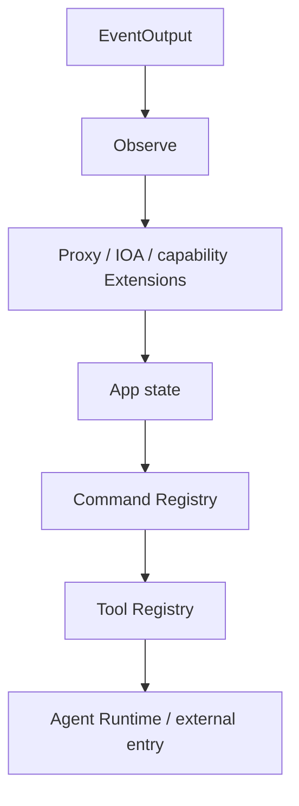

# Cyber Harness 架构

Cyber Harness 可以脱离 Agent 作为 Go 工具库或 AOP ToolNode 使用；内置 Agent 只是一个
Profile。当前边界和待验收项见 [Issue 127 约定](issue127-extension-boundary.md)。

## 组合与关闭

`cmd/aiscan` 与 `cmd/runner` 声明各自固定的 Extension 图并创建唯一的
`core/extension.Set`。可复用 host 通过 `pkg/profile.Application` 访问命令入口的具体组合；
`profile.Assembly` 只委托同一个 Set，不保存产品能力，也不实现第二套生命周期状态。具体
`aiscanProfile` 位于 `cmd/aiscan`，显式发布 App、Runtime 与 Proxy 能力。依赖通过构造参数传入，
`DependsOn` 只表达资源寿命：依赖先加载、依赖者先关闭。共享包不包含任何具体产品 Profile。

关闭顺序反向执行：入口停止，两个 Registry 拒绝新工作、取消并 drain，资源 Extension
随后释放。Close 返回 `ErrCloseIncomplete` 时保留依赖，重试继续原关闭过程。具体入口负责
构造能力并声明 Entries；App 只提供产品访问面，不选择扩展，也不创建嵌套 Set。

## 两类执行运行时

`pkg/toolset.Registry` 服务 Agent Tool：JSON Schema、字符串 JSON 参数和结构化结果。
`pkg/commands.Registry` 服务 Bash 原生命令：argv、环境、stdio 和 PTY。它们不是同一
领域，但都委托 `core/registry.Store[T]` 管理 collecting、active、draining、closed。

`Registry` 表示可执行实例；`Catalog` 仅表示静态描述或协议投影。Skill 是 prompt/知识，
没有直接执行协议，也不并入 Tool 或 Command。

## 控制与事实

`core/hooks` 提供 typed 控制点和观察点；`core/operation` 提供执行身份、父子 operation
和取消。执行前控制可以拒绝或取消，执行后观察不能修改事实。策略 Extension 直接将准入
结果发布为 typed `operation.Decision`；Observe 不反向参与准入，也不代替策略发布决策。

`core/events.Stream` 统一补全 AOP Event 的 ID、时间和序号。生产者调用 `Publish`，同步
投影调用 `Observe`，有界持久化调用 `Consume`。`pkg/exts/observe` 把选中的
Tool、Command、Process、File、HTTP hook 转成 typed AOP Event，`pkg/exts/eventoutput`
将同一 Stream 异步、可排空地写入 JSONL。Console、Web、Node 和 stdio 只订阅事件流。

CLI 中 `--observe` 只选择观测种类，`-o/--output` 只选择 AOP JSONL 持久化位置；
`--output-format=text|json|stream-json` 只控制一次性 Agent 的 stdout。`-f/--file` 仅是
`--view` 的渲染目标，`--resume` 只读历史，三者不会互相隐式启用。

文件访问直接来自 `tools/files` 的真实 IO 边界；进程事件来自 `pkg/commands` 的真实启动与
退出边界；HTTP 事件在 Proxy FlowStore 完成提交后产生。它们通过
`aop.operation.Ref` 关联，不复制另一套 tool ID 或日志消息。

## Agent、Session 与入口

`agent/` 只依赖 Provider 和 `tool.Executor`。`pkg/exts/agent.Extension` 是唯一 Agent
生命周期所有者；它发布的 `Runtime` 同时承载受控 Loop、Session、Run、队列、Inbox、
取消和恢复，且不暴露 Load/Close。每个 Session 使用已加载 App 的能力。Hook 控制动作，Inbox
增加后续上下文，Cancel 停止工作，Event 记录事实，四者不互相替代。

`pkg/host` 只拥有 inline/stdio 通信；Console、Web 和 Node 是并列入口，不包装或关闭
App/Profile 的资源。

## 包职责

| 位置 | 责任 |
| --- | --- |
| `core/extension` | 固定图与资源关闭顺序 |
| `core/registry` | 命名执行能力的准入与 drain |
| `core/hooks` / `core/operation` / `core/events` | 执行控制、身份、事实流 |
| `pkg/exts/*` | 具体 Extension 所有者 |
| `pkg/toolset` / `pkg/commands` | 两类领域 Registry |
| `tools/*` | 原始能力实现 |
| `agent/` | Agent loop |
| `pkg/app` | 产品状态与访问面 |
| `pkg/profile` | 通用 host 契约与无产品状态的 `Assembly` |
| `cmd/aiscan`、`cmd/runner` | 各可执行产品的具体 Profile 与唯一组合根 |
| `pkg/exts/agent` | Agent Runtime 的唯一生命周期适配与 Session 宿主 |

文件能力只有 `pkg/exts/files` 一个扩展，底层位于 `tools/files`。无 Agent 的
`cmd/runner` 的文件组合直接暴露 `tool.Executor`，其底层依赖闭包不包含 App、Session、Console、
Web 或 Node。代理行为位于 `tools/proxy`；`pkg/exts/proxy.Extension` 将唯一 Hub 适配到 Set，
连接级 Traffic handler 直接由连接自己的 `NamespaceMux` 管理。Extension 组合变化通过整体
Profile 换代完成；Provider 配置更新按 Run 快照隔离，活跃 Run 保留原 Provider。
