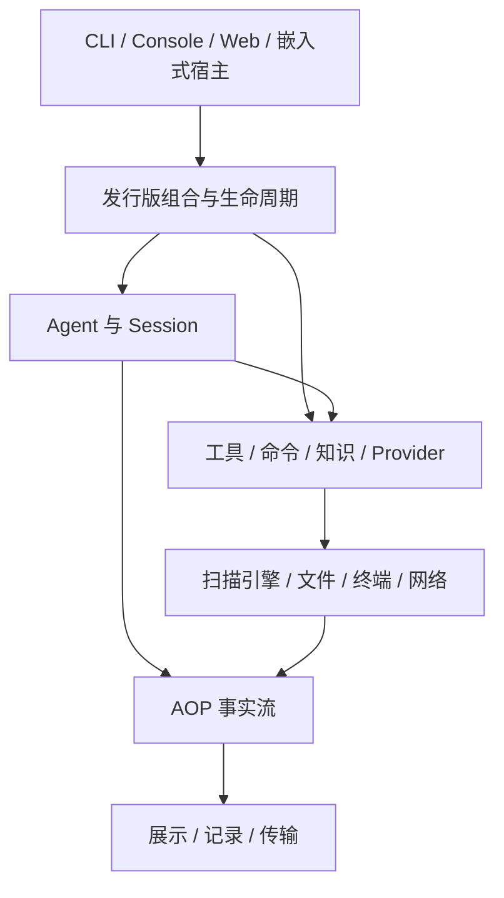

# 架构概览

[文档首页](README.md) · 前置：[基本概念](concepts.md) · 开发：[构建应用](development.md)

cyber-harness 的核心结构是宿主、扩展组合和执行运行时。宿主接收输入并管理应用寿命；扩展组合提供运行需要的能力；运行时使用这些能力推进任务。安全扫描器、Web 和 IOA 位于这套结构之上，形成 aiscan 发行版。

## 应用结构

`agent/` 提供模型循环和会话机制，`core/` 提供资源、hooks、操作关联和事件等基础设施。业务实现多位于 `tools/`，对应扩展在 `pkg/exts/` 中将实现接入资源与生命周期。

`pkg/harness.BaseExtensions` 返回有序的默认扩展，`harness.New` 在此之上提供工具宿主和会话 Agent 的通用组合；`cmd/aiscan` 负责解析配置、加入扫描器和代理等产品能力，并选择运行入口。最小 `cmd/agent` 使用同一基础组合，但不安装安全扫描、IOA 和 Web。应用功能由明确的组合决定。

## 装配与生命周期

宿主先选择扩展，构造一个线性的 `extension.Set`，再加载它。较早的扩展定义贡献点或发布共享能力，较晚的扩展贡献内容或借用能力。例如工具注册表接收多个工具实现，同时向 Session 提供统一的执行接口。

加载顺序显式写在组合代码中，关闭按相反顺序进行。扩展撤销自己的注册，排空自己持有的工作，最后释放对其他能力的借用。因此 Session 结束执行时，仍然可以使用尚未关闭的工具与事件设施。加载失败会回滚，关闭超时则保留未回收资源供重试。

[扩展组合](architecture/composition.md)详细说明贡献与借用、加载顺序、关闭阶段和能力所有权。这里的线性组合与扫描流水线的任务图分属不同层次。

## Agent 与 Session

Session 持有对话状态和输入队列，一次外部提交形成一次 Turn。Agent 的标准循环在执行过程中多次请求模型：准备上下文、调用 Provider、执行工具、追加结果，直到满足结束条件。目标评估位于循环外层，可以根据验收反馈再次执行。

后台命令、子 Agent 和协作消息通过 Inbox 回到运行时。活跃的后台生产者使循环能够等待尚未返回的结果；上下文增长则由压缩策略处理。Session、模型轮次和后台工作各自有明确的状态，避免将网络连接的寿命直接当作任务寿命。

具体推进、并发与收尾见 [Agent 运行时](architecture/runtime.md)，模型请求内容的构造见[上下文与知识](architecture/context.md)。

## 执行环境

模型调用经过 Tool Registry；其中 `bash` 将命令路由到 Command Registry 或外部 shell。内置函数、PTY 进程和管道进程统一纳入工作单元管理，但保留各自的能力差异。代理扩展发布共享出口，使内置工具和支持代理环境变量的外部程序使用相同的网络路由。

执行链上的 hooks 提供准入、结果处理与观察，operation 传递调用关联及取消信息。领域实现依赖这些明确的边界，不需要知道任务来自哪个界面。详细过程见[执行环境](architecture/execution.md)。

## 事件与数据

AOP Event 记录消息、工具调用、结果和生命周期等事实。终端、持久化输出和 Web 可以消费同一事实流，展示不必重新实现任务执行。hooks 用于执行中的控制，事件用于记录事实，二者具有不同的失败和调用语义。

扫描原生产物以 Artifact 形式保存。当前 Web 路径由 Go 归档原始事件，浏览器使用 CSTX WASM 生成规范化资产视图。CLI 的历史文件保存 Event，而跨连接传输使用 Envelope；恢复历史、消费实时事件和查询资产不是同一个操作。完整说明见[事件与持久化](architecture/data.md)。

## 宿主与协议

Go 宿主直接持有组合和 Session Runtime。跨进程宿主通过 AOP 发送请求、订阅事件和取消操作；Web 另有 ConnectRPC 管理面处理配置、历史及节点查询。IOA 则提供独立的消息协作空间。

宿主拥有监听和连接，运行时拥有执行状态，协议适配负责传输与错误映射。这些边界使本地 CLI、Web 和远程节点能够复用既有执行机制。接入实现见[宿主集成](developer/hosting.md)，线协议与迁移状态见[协议架构](protocol-architecture.md)。

## 源码阅读

从 [harness.BaseExtensions](../pkg/harness/base.go)、[aiscan 的能力选择](../cmd/aiscan/extensions.go)和 [Profile](../cmd/aiscan/profile.go)可以读到完整装配顺序。随后沿 [Session](../agent/session/session.go)进入 [StandardLoop](../agent/loop.go)，再跟进所调用的工具。各专题末尾提供对应实现与测试入口。

## 代码组织与依赖边界

`core` 承担资源生命周期、执行与事件机制，不依赖 `agent`、`pkg` 或 `tools`。命令和模型工具在 `core/tool` 中分别由 `CommandRegistry`、`ToolRegistry` 管理，保留不同的执行接口与资源所有权；`core/proc` 提供进程会话管理和事件桥接。`core/tool/hooks` 使用 AOP 载荷表达执行边界，避免反向依赖工具注册表。

`pkg/config` 和 `pkg/output` 分别负责应用配置和输出。`pkg/harness` 提供默认组装；具体产品的配置转换、能力选择和运行模式位于 `cmd/aiscan`。需要控制扩展顺序的宿主使用 `harness.BaseExtensions` 和 `extension.New`；`harness.New` 提供固定顺序的默认组合。

扫描命令自行保证命令输出不含颜色控制符，`core/tool` 不按业务命令名改写参数。扫描收集器的结果类型归 `tools/scan` 私有，Loot 直接使用 `parsers.Loot`；`pkg/output` 仅承载共享的事件读取、渲染和格式化。`pkg/app` 的 Provider 状态与配置转换直接依赖 `agent/provider`，无需经过 Agent 根包的类型别名。

IOA client/server 的 CLI 声明与 Session、IOA client 的 Console 贡献和各自扩展放在同一包，以文件划分职责。`NewConsole` 仍是独立安装入口，合包不改变可选性或加载顺序。IOA client 和 server 保持独立，避免客户端引入服务端依赖。

共享状态 `pkg/app`、宿主契约 `pkg/profile`、启动声明 `pkg/cli` 和展示契约 `pkg/console/api` 有多个非扩展消费者，继续独立。测试辅助位于 `internal/testutil/hosttest` 与 `internal/testutil/apptest`，后者可以依赖前者，避免低层测试引入完整应用图。
