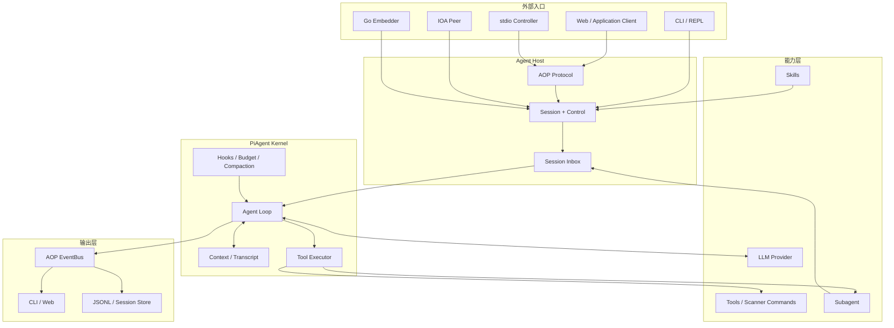
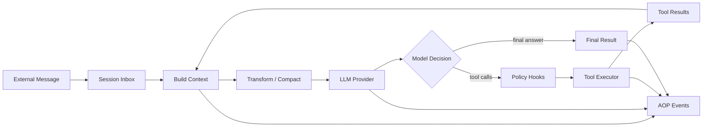
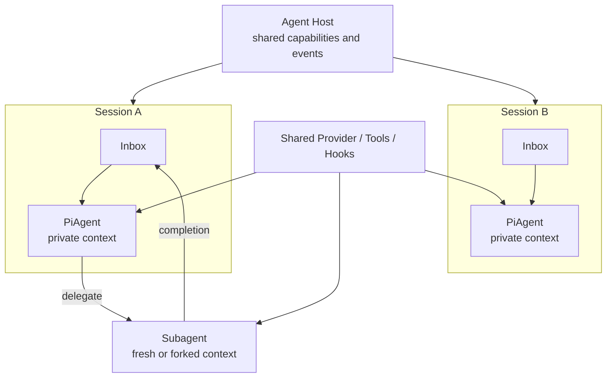

# AIScan Agent 架构

AIScan 的核心是一个可嵌入、可扩展、可远程驱动的 Agent 内核。本文用 **PiAgent** 指代 `agent/` 中的 Agent kernel；代码中的公开类型仍为 `agent.Agent`。

PiAgent 的职责是：**维护上下文，调用 LLM，根据模型决策执行工具，并将执行过程输出为统一事件。**

它不直接处理 Web、CLI 或多会话管理。外部任务由 Agent Host 写入 Inbox，PiAgent 从 Inbox 取出消息并执行，从而让所有入口复用同一个 Agent 内核。Agent Host 在代码中对应 `AgentRuntime`。

## 1. 总体架构

架构分为四层：

| 层 | 核心职责 |
| --- | --- |
| 入口与协议 | 接收外部消息和生命周期控制，传递实时事件 |
| Agent Host | 将消息写入 Inbox，管理 Session、取消和恢复 |
| PiAgent | 完成模型决策、上下文管理和工具调用循环 |
| 能力与输出 | 提供 LLM、工具、Skill，并消费统一事件流 |

Scan 是与 Agent 平级的确定性执行路径。两者复用相同的工具和事件体系，但只有 Agent 经过 LLM 决策循环。

## 2. PiAgent 核心设计

PiAgent 是一个小而稳定的内核。它不理解具体扫描器，也不绑定某个模型供应商，只依赖 Provider 和 Tool Executor 两个能力边界。

一次任务执行的关键过程是：

1. 外部消息先写入 Session Inbox。
2. PiAgent 从 Inbox 取出消息，将其合并到 Transcript 并构造本轮上下文。
3. 调用 Provider，并接收模型文本或 tool call。
4. 工具执行前经过策略检查，再由统一 Executor 调用工具。
5. 工具结果写回上下文并继续决策，直到完成、达到预算或被取消。

这套循环保持三个关键约束：

- **上下文一致**：每轮 Provider 请求使用稳定快照，异步结果只在轮次边界进入。
- **副作用受控**：LLM 不能直接访问 shell、网络或 scanner，所有能力必须经过 Tool Executor。
- **过程可观察**：message、tool、usage、error 和生命周期统一输出为 AOP Event。

### Context 与状态

`agent.Agent` 保存跨任务的消息历史，因此同一个 Agent 可以连续对话。每次执行开始时会取得 Config 快照，正在执行的任务不会受到中途切换 Provider 或配置的影响。

上下文接近模型窗口时会自动压缩；工具输出也会在送回模型前限制大小，避免一次扫描结果耗尽整个上下文。

### Tool 与 Skill

- **Tool** 是 LLM 可以实际调用的能力，例如文件、搜索、shell、scanner 和 subagent。
- **Command** 是 AIScan 的可执行命令，由 CommandRegistry 管理，并可以通过工具入口复用。
- **Skill** 是提供给 Agent 的知识和工作方式，不直接执行代码。

PiAgent 只看到工具定义和工具结果，不在内核中按工具名称编写业务分支。新增能力应通过注册 Tool、Command 或 Skill 完成。

## 3. Session 与子 Agent

Agent Host 负责管理多个 Session，并将不同入口的消息送入对应 Inbox。

每个 Session 拥有独立的 Inbox、PiAgent 和上下文。Provider、Tools、Hooks、Skills 和 EventBus 由 Runtime/App 共享。

子 agent 从父 Agent 派生，共享基础能力但拥有独立状态。它可以同步返回，也可以在后台执行并通过父 Inbox 回传结果。父子关系会进入 AOP 事件，外部可以还原完整的 Agent 调用树。

Inbox 是所有动态消息进入 Agent 的统一入口，典型来源包括用户任务、follow-up、IOA peer、后台工具、定时任务和子 agent。它避免外部生产者直接调用 PiAgent 或修改 Transcript。

## 4. 外部如何介入

外部介入分为两类：

- **跨进程消息与控制**：通过 AOP、stdio 或 IOA 提交消息或操作 Session 生命周期。
- **进程内扩展**：通过 Provider、Tool、Skill、Hook 和 EventBus 扩展 PiAgent。

| 介入目标 | 正式入口 | 作用 |
| --- | --- | --- |
| 发起或继续任务 | `RunTurn` / `RunInput` | 转换为 Inbox 消息并唤醒 Agent |
| 追加异步信息 | Inbox / IOA | 写入 Inbox，在轮次边界加入上下文 |
| 停止任务 | `CancelTurn` / context cancel | 取消当前执行 |
| 调整模型行为 | Provider / Config / Skill | 改变模型、提示和知识 |
| 扩展执行能力 | Tool / Command registration | 增加 Agent 可调用能力 |
| 约束执行策略 | Hook Registry | 改写上下文、审批工具、处理结果 |
| 观察运行过程 | EventBus / WatchEvents | 消费事件，不直接修改执行 |

### 跨进程入口

AOP 是远程接入的正式协议边界。`RunTurn` 中的输入经 Runtime 写入 Session Inbox，再由 PiAgent 消费；Web Hub 可以把请求路由到本地或远程 Agent Node，但最终遵守相同的入口顺序。

`OpenSession`、`CancelTurn` 和 `CloseSession` 属于生命周期控制，由 Runtime 直接处理，不进入对话 Inbox。消息面与控制面保持分离。

`RunTurnResponse` 只是任务已接收的回执，实际回答和工具过程通过事件流返回，`turn_ended` 是一轮结束的稳定信号。

IOA 不直接操作 Agent 内存，而是将 peer 消息写入 Session Inbox。这样外部协作与本地异步任务使用同一套消息语义。

### 进程内扩展

Hook 是 PiAgent 的策略扩展点，关键阶段包括：

- 任务开始时调整 system prompt；
- Provider 调用前过滤或补充上下文；
- Tool 执行前审批或阻断；
- Tool 执行后改写、脱敏或终止；
- 任务和 Session 结束时进行审计与清理。

工具审批采用 fail-closed：策略 handler 失败时不会放行工具。EventBus 则只负责观察，不能替代执行前的 Hook。简单说，**Hook 控制未来动作，Inbox 增加新信息，Event 记录已经发生的事实。**

## 5. 关键设计原则

1. **一个 Agent 内核**：CLI、Web、stdio、IOA 和 `--ai` 复用同一套 Agent Host/PiAgent。
2. **Session 隔离**：上下文和 Inbox 属于 Session，Provider、Tools、Hooks 和 EventBus 可以共享。
3. **控制与观察分离**：Hook、Inbox、Cancel 可以改变执行；EventBus 只描述执行事实。
4. **能力通过工具扩展**：LLM 的所有副作用都经过 Tool Executor 和策略检查。
5. **异步结果通过 Inbox 回流**：后台任务和子 agent 不直接修改上下文。
6. **跨进程统一使用 AOP**：Application、Node 和 stdio 共享 protobuf Envelope 和事件语义。

## 6. 代码导航

| 关注点 | 实现位置 |
| --- | --- |
| PiAgent API 与状态 | `agent/agent.go`、`agent/types.go` |
| 核心循环 | `agent/loop.go` |
| Inbox、Hooks、Subagent | `agent/inbox/`、`agent/hooks/`、`agent/subagent.go` |
| Runtime 与 Session | `pkg/runner/runner.go`、`pkg/runner/runtime_session.go` |
| Tool 与 Command | `core/tool/`、`pkg/commands/` |
| AOP Runtime 接口 | `pkg/runner/runtime_protocol.go` |
| Web 与远程 Node | `pkg/web/`、`pkg/node/` |
| 协议设计 | [protocol-architecture.md](protocol-architecture.md) |
| 第三方接入 | [integration.md](integration.md) |
