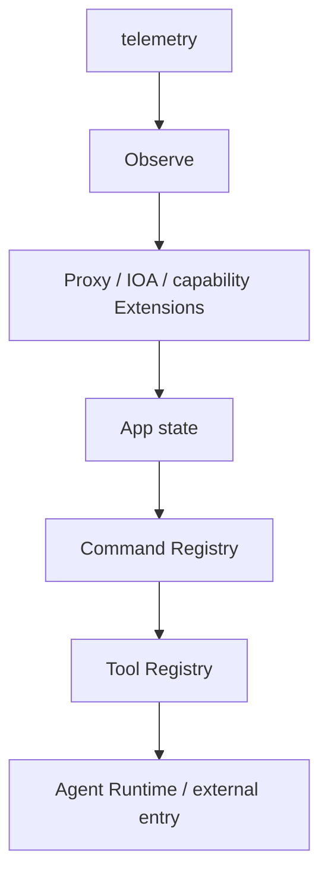

# Cyber Harness 架构

Cyber Harness 可以脱离 Agent 作为 Go 工具库或 AOP ToolNode 使用；内置 Agent 只是一个
Profile。系统采用分层 Plugin/Extension 组合：Profile 选择 Provider、Consumer 和贡献者，
`core/extension` 只负责生命周期、依赖拓扑和类型化 Service contract。

## 组合与关闭

`cmd/cyber` 与 `cmd/runner` 为每个独立运行时声明固定的 Extension 图和唯一的
`core/extension.Set`。Web 的 IOA Server 属于宿主图，寿命独立于可替换的应用 Profile。可复用 host 通过 `pkg/profile.Application` 访问命令入口的具体组合；
具体 Profile 直接持有 Set，不另设 Assembly 包装。
`cyberProfile` 位于 `cmd/cyber`，显式发布 App、Runtime 与 Proxy 能力。Profile 先解析
Service Provider/Consumer，再构造唯一的 `extension.Set`；`DependsOn` 只表达资源寿命。
共享包不包含任何具体产品 Profile。

关闭顺序反向执行：入口停止，两个 Registry 拒绝新工作、取消并 drain，资源 Extension
随后释放。Close 返回 `ErrCloseIncomplete` 时保留依赖，重试继续原关闭过程。具体入口负责
构造能力并声明 Entries；App 只提供产品访问面，不选择扩展，也不创建嵌套 Set。

## Plugin 与 Extension

### EventBus 是 Core 的唯一事件原语

`core/eventbus` 只提供泛型 `Bus[T]`、`Subscription[T]`、同步观察和有界异步消费。
它不认识 AOP、Protobuf、DTO、Sink、JSONL 或任何产品事件模型。事件编号、Envelope、
观测投影和持久化均由 Extension 通过选择具体的 `T` 实现。消费者直接实现回调并使用
`Subscription.Flush/Close` 完成排空，不再引入第二套 Sink 生命周期。

`signals` 负责 Hook；AOP 事件发布、`observe` 投影和 `telemetry` 持久化是可选 Extension，
它们共享 Profile 内的 typed EventBus，但任何一个都不是 Core 的隐式默认实现。

每个机制由三个角色组成：Service Definition 定义 typed contract，Provider Extension
发布实现，Consumer Extension 通过构造期解析使用它。静态 `Descriptor` 声明
`Provides`、`Requires`、`Optional`、flags 和 config；运行时 `Registrar` 只允许向基础
Extension 提供的 Extension Point 注册贡献。

基础注册点包括：

| Extension | 注册点/服务 |
| --- | --- |
| `settings` | flags、config、CLI metadata |
| `signals` | Hook Registry、AOP Event Stream |
| `harness` | Tool Registrar、Native Command Registrar |
| `tui` | REPL、renderer、completion、status |
| `agent` | Agent Loop provider |
| `session` | Session service 与 Session command catalog |
| `provider` | LLM provider/adapter routes |
| `skills` | Skill provider/catalog |
| `web` | HTTP route/middleware |
| `ioa` | IOA namespace、连接和展示贡献 |

Provider 只能在自己的 Extension 生命周期内注册和撤销；Registrar 封存后发布只读快照。
Extension 组合变化通过重建 Profile 完成，避免运行中替换已有 Session、Agent 或 Host。

当前 Extension 清单：

| Extension | 作用 |
| --- | --- |
| `agent` | Agent Loop admission、取消和 drain |
| `session` | Session manager、历史、协议和 Session command catalog |
| `settings` | flags/config/CLI 静态声明收集 |
| `signals` | Hook Registry 与 AOP Event Stream |
| `harness` | Tool 与 Native Command 基础设施 |
| `tui` | REPL、补全、状态和 renderer 注册点 |
| `files` | 文件系统与文件工具 |
| `terminal` | Bash、PTY 和进程能力 |
| `scanner` | Scanner engine 与扫描命令/工具 |
| `search` | Web search 工具与命令 |
| `proxy` | Proxy Hub、流量捕获和 HTTP 事件 |
| `provider` | LLM Provider 状态和切换 |
| `skills` | Skill 目录、加载和 Catalog |
| `observe` | Hook 到 AOP observation 的转换 |
| `telemetry` | AOP Event 持久化输出 |
| `ioa/client`、`ioa/server` | IOA client/server 连接与协议能力 |
| `session/console`、`ioa/client/console` | 向 TUI 注册 REPL 展示贡献 |
| `arsenal`、`browser`、`record`、`web` | 对应的可选资源、浏览器、录制和 Web 能力 |

## 可选能力的声明边界

配置、CLI、Console 展示、探测和 HTTP 路由均可由 Extension 提供声明或 Registrar。
`settings` 在 Extension Load 前收集 flags/config；`harness`、`signals`、`tui`、`web`
等基础 Extension 在 Load 时开放各自 Point，贡献者随后注册实现。配置节装入
`Option.Extensions` / protobuf `extensions`，通用层不按扩展名称选择实现。

IOA 只有独立的 client/server 两个扩展。通用 Profile 不再暴露 IOA Reader，Node 只转发产品
贡献的 capability 和完整状态快照，通用 skills 不包含 IOA 内容。具体装配与兼容说明见
[IOA](ioa.md)。启动声明、资源生命周期和运行中的业务能力不互相冒充。

## 两类执行运行时

`pkg/toolset.Registry` 服务 Agent Tool：JSON Schema、字符串 JSON 参数和结构化结果。
`pkg/commands.Registry` 服务 Bash 原生命令：argv、环境、stdio 和 PTY。它们不是同一
领域，但都委托 `core/registry.Store[T]` 管理 collecting、active、draining、closed。

`Registry` 表示可执行实例；`Catalog` 仅表示静态描述或协议投影。Skill 是 prompt/知识，
没有直接执行协议，也不并入 Tool 或 Command。

## 控制与事实

`core/hooks` 提供 typed 控制点和观察点；`core/operation` 提供执行身份、父子 operation
和取消。执行前控制可以拒绝或取消，执行后观察不能修改事实。策略 Extension 直接将准入
结果发布为 typed `operation.Decision`；Observe 不反向参与准入，也不代替策略发布决策。

`core/events.Stream` 统一补全 AOP Event 的 ID、时间和序号。生产者调用 `Publish`，同步
投影调用 `Observe`，有界持久化调用 `Consume`。`pkg/exts/observe` 把选中的
Tool、Command、Process、File、HTTP hook 转成 typed AOP Event，`pkg/exts/telemetry`
将同一 Stream 异步、可排空地写入 JSONL。Console、Web、Node 和 stdio 只订阅事件流。

CLI 中 `--observe` 只选择观测种类，`-o/--output` 只选择 AOP JSONL 持久化位置；
`--output-format=text|json|stream-json` 只控制一次性 Agent 的 stdout。`-f/--file` 仅是
`--view` 的渲染目标，`--resume` 只读历史，三者不会互相隐式启用。

文件访问直接来自 `tools/files` 的真实 IO 边界；进程事件来自 `pkg/commands` 的真实启动与
退出边界；HTTP 事件在 Proxy FlowStore 完成提交后产生。它们通过
`aop.operation.Ref` 关联，不复制另一套 tool ID 或日志消息。

## Agent、Session 与入口

`agent/` 只依赖 Provider 和 `tool.Executor`。`pkg/exts/agent.Extension` 拥有 Agent Loop
生命周期；`pkg/exts/session.Extension` 独立拥有 Session service，并借用已解析的 Loop。
两者发布的 Runtime 都不暴露 Load/Close。每个 Session 使用已加载 App 的能力。Hook 控制动作，Inbox
增加后续上下文，Cancel 停止工作，Event 记录事实，四者不互相替代。

`pkg/host` 只拥有 inline/stdio 通信；Console、Web 和 Node 是并列入口，不包装或关闭
App/Profile 的资源。

## 包职责

| 位置 | 责任 |
| --- | --- |
| `core/extension` | 固定图、Service contract 与资源关闭顺序 |
| `core/registry` | 命名执行能力的准入与 drain |
| `core/hooks` / `core/operation` / `core/events` | 执行控制、身份、事实流 |
| `pkg/exts/*` | 具体 Extension 所有者 |
| `pkg/toolset` / `pkg/commands` | 两类领域 Registry |
| `tools/*` | 原始能力实现 |
| `agent/` | Agent loop |
| `pkg/app` | 产品状态与访问面 |
| `pkg/profile` | 产品 Application/Factory/Request 契约 |
| `cmd/cyber`、`cmd/runner` | 各可执行产品的具体 Profile 与唯一组合根 |
| `pkg/exts/agent` | Agent Loop 生命周期适配 |
| `pkg/exts/session` | Session service 生命周期适配 |

文件能力只有 `pkg/exts/files` 一个扩展，底层位于 `tools/files`。无 Agent 的
`cmd/runner` 的文件组合直接暴露 `tool.Executor`，其底层依赖闭包不包含 App、Session、Console、
Web 或 Node。代理行为位于 `tools/proxy`；`pkg/exts/proxy.Extension` 将唯一 Hub 适配到 Set，
连接级 Traffic handler 直接由连接自己的 `NamespaceMux` 管理。Extension 组合变化通过整体
Profile 换代完成；Provider 配置更新按 Run 快照隔离，活跃 Run 保留原 Provider。

