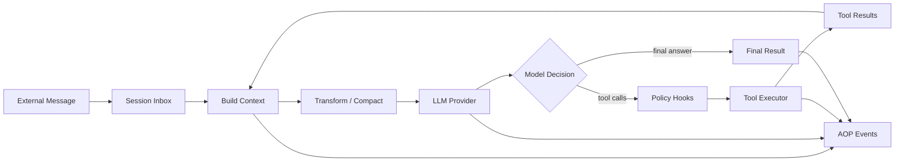
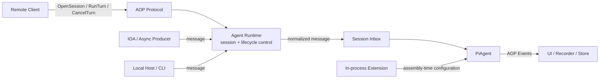

# AIScan Agent 架构

AIScan 的核心是一个可嵌入、可扩展、可远程驱动的 Agent 内核。本文用 **PiAgent** 指代 `agent/` 中的 Agent kernel；代码中的公开类型仍为 `agent.Agent`。

PiAgent 的职责是：**维护上下文，调用 LLM，根据模型决策执行工具，并将执行过程输出为统一事件。**

它不直接处理 Web、CLI 或多会话管理。外部任务由 Agent Runtime 写入 Inbox，PiAgent 从 Inbox 取出消息并执行，从而让所有入口复用同一个 Agent 内核。运行层在代码中对应 `AgentRuntime`；`pkg/host.Host` 专指 stdio/inline 嵌入通信层。

## 1. 总体架构

架构分为四层：

| 层 | 核心职责 |
| --- | --- |
| 入口与协议 | 接收外部消息和生命周期控制，传递实时事件 |
| Agent Runtime | 将消息写入 Inbox，管理 Session、取消和恢复 |
| PiAgent | 完成模型决策、上下文管理和工具调用循环 |
| 能力与输出 | 提供 LLM、工具、Skill，并消费统一事件流 |

Scan 是与 Agent 平级的确定性执行路径。两者复用相同的工具和事件体系，但只有 Agent 经过 LLM 决策循环。

## 2. PiAgent 核心设计

PiAgent 是一个小而稳定的内核。它不理解具体扫描器，也不绑定某个模型供应商，只依赖 Provider 和 Tool Executor 两个能力边界。

一次任务执行的关键过程是：

1. 外部消息先写入 Session Inbox。
2. PiAgent 从 Inbox 取出消息，将其合并到 Transcript 并构造本轮上下文。
3. 调用 Provider，并接收模型文本或 tool call。
4. 工具执行前经过策略检查，再由统一 Executor 调用工具。
5. 工具结果写回上下文并继续决策，直到完成、达到预算或被取消。

这套循环保持三个关键约束：

- **上下文一致**：每轮 Provider 请求使用稳定快照，异步结果只在轮次边界进入。
- **副作用受控**：LLM 不能直接访问 shell、网络或 scanner，所有能力必须经过 Tool Executor。
- **过程可观察**：message、tool、usage、error 和生命周期统一输出为 AOP Event。

### Context 与状态

`agent.Agent` 保存跨任务的消息历史，因此同一个 Agent 可以连续对话。每次执行开始时会取得 Config 快照，正在执行的任务不会受到中途切换 Provider 或配置的影响。

上下文接近模型窗口时会自动压缩；工具输出也会在送回模型前限制大小，避免一次扫描结果耗尽整个上下文。

### Tool 与 Skill

- **Tool** 是 LLM 可以实际调用的能力，例如文件、搜索、shell、scanner 和 subagent。
- **Command** 是 AIScan 的可执行命令，由 CommandRegistry 管理，并可以通过工具入口复用。
- **Skill** 是提供给 Agent 的知识和工作方式，不直接执行代码。

PiAgent 只看到工具定义和工具结果，不在内核中按工具名称编写业务分支。新增能力应通过注册 Tool、Command 或 Skill 完成。

## 3. Session 与子 Agent

Agent Runtime 负责管理多个 Session，并将不同入口的消息送入对应 Inbox。

每个 Session 拥有独立的 Inbox、PiAgent 和上下文。Provider、Tools、Hooks、Skills 和 EventBus 由 Runtime/App 共享。

子 agent 从父 Agent 派生，共享基础能力但拥有独立状态。它可以同步返回，也可以在后台执行并通过父 Inbox 回传结果。父子关系会进入 AOP 事件，外部可以还原完整的 Agent 调用树。

Inbox 是所有动态消息进入 Agent 的统一入口，典型来源包括用户任务、follow-up、IOA peer、后台工具、定时任务和子 agent。它避免外部生产者直接调用 PiAgent 或修改 Transcript。

## 4. 外部如何介入

外部介入分为两类：

- **跨进程消息与控制**：通过 AOP、stdio 或 IOA 提交消息或操作 Session 生命周期。
- **进程内扩展**：通过 Provider、Tool、Skill、Hook 和 EventBus 扩展 PiAgent。

| 介入目标 | 正式入口 | 作用 |
| --- | --- | --- |
| 发起或继续任务 | `RunTurn` / `RunInput` | 转换为 Inbox 消息并唤醒 Agent |
| 追加异步信息 | Inbox / IOA | 写入 Inbox，在轮次边界加入上下文 |
| 停止任务 | `CancelTurn` / context cancel | 取消当前执行 |
| 调整模型行为 | Provider / Config / Skill | 改变模型、提示和知识 |
| 扩展执行能力 | Tool / Command registration | 增加 Agent 可调用能力 |
| 约束执行策略 | Hook Registry | 改写上下文、审批工具、处理结果 |
| 观察运行过程 | EventBus / WatchEvents | 消费事件，不直接修改执行 |

### 跨进程入口

AOP 是远程接入的正式协议边界。`RunTurn` 中的输入经 Runtime 写入 Session Inbox，再由 PiAgent 消费；Web Hub 可以把请求路由到本地或远程 Agent Node，但最终遵守相同的入口顺序。

`OpenSession`、`CancelTurn` 和 `CloseSession` 属于生命周期控制，由 Runtime 直接处理，不进入对话 Inbox。消息面与控制面保持分离。

`RunTurnResponse` 只是任务已接收的回执，实际回答和工具过程通过事件流返回，`turn_ended` 是一轮结束的稳定信号。

IOA 不直接操作 Agent 内存，而是将 peer 消息写入 Session Inbox。这样外部协作与本地异步任务使用同一套消息语义。

### 进程内扩展

Hook 是 PiAgent 的策略扩展点，关键阶段包括：

- 任务开始时调整 system prompt；
- Provider 调用前过滤或补充上下文；
- Tool 执行前审批或阻断；
- Tool 执行后改写、脱敏或终止；
- 任务和 Session 结束时进行审计与清理。

工具审批采用 fail-closed：策略 handler 失败时不会放行工具。EventBus 则只负责观察，不能替代执行前的 Hook。简单说，**Hook 控制未来动作，Inbox 增加新信息，Event 记录已经发生的事实。**

## 5. 关键设计原则

1. **一个 Agent 内核**：CLI、Web、stdio、IOA 和 `--ai` 复用同一套 Agent Runtime/PiAgent。
2. **Session 隔离**：上下文和 Inbox 属于 Session，Provider、Tools、Hooks 和 EventBus 可以共享。
3. **控制与观察分离**：Hook、Inbox、Cancel 可以改变执行；EventBus 只描述执行事实。
4. **能力通过工具扩展**：LLM 的所有副作用都经过 Tool Executor 和策略检查。
5. **异步结果通过 Inbox 回流**：后台任务和子 agent 不直接修改上下文。
6. **跨进程统一使用 AOP**：Application、Node 和 stdio 共享 protobuf Envelope 和事件语义。

## 6. 包边界与资源所有权

`pkg/app` 负责产品资源装配与共享状态；`pkg/runtime` 负责 Agent Runtime/Session/Run；
`pkg/runner` 只保留产品入口组合，不新增通用容器。
`pkg/host` 已独立为嵌入通信包：inline 使用 `Handle`，stdio 使用 `Stdio` 与 `Serve`，
两者通过现有 `aop.NamespaceMux` 分发。Web 使用已有 `pkg/web.Connection`，Node 使用已有连接循环和写队列；
握手由各自入口负责，不再叠加第二个 Host。该包不持有 Agent、Session 或 App，也不新增
DTO、Sink、Transport 接口或业务包装对象。产品负责注册业务处理函数，并在结束时
等待自己的操作、关闭自有资源和注销事件订阅。Envelope ID、Reply 和错误消息构造属于 AOP，
Runtime 不因协议辅助函数依赖 Host。详见 [Host 使用说明](../pkg/host/README.md)。

Session 执行与 JSONL 恢复位于 `pkg/runtime`，其传递依赖不包含 TUI、Console、Host 或入口包。
`pkg/console` 拥有本地/远程 REPL、静态输出及其订阅，直接使用 Runtime/Session 和外部终端库。
`pkg/runner` 负责模式选择、Scanner 直接入口和 IOA 服务端启动；Node/Web 保留各自的传输装配。

| 边界 | 约束 |
| --- | --- |
| `agent/` | 不导入具体工具或入口包；当前 `pkg/types` 产品扩展依赖保留 |
| `pkg/host/` | 仅依赖 AOP、protobuf 和标准库；通信与业务生命周期分离 |
| `tools/` | 不导入 Runner、TUI、Web、Node 或 `cmd/` |
| `pkg/app/` | 拥有 Provider、CommandRegistry、Skills、Hooks、EventBus、引擎、IOA、Recorder 等产品资源 |
| `pkg/runtime/` | 拥有 Session/Run/Inbox/调度与 JSONL 恢复；借用或创建 App |
| `pkg/console/` | 拥有终端任务及展示订阅，直接使用具体 Runtime 和 Session |
| `pkg/runner/` | 入口组合；不直接导入 TUI |

App 直接实现既有 `aop.EventEmitter`，持有跨 Runtime 共享的序号状态；没有独立的事件转发对象。
Provider 字段由 App 私有持有，构建与健康探测由 App 负责，Runtime 负责更新自己的会话模板。
Web 的配置管理直接引用 App。详见 [App 使用说明](../pkg/app/README.md)。

已有 `tool.Executor` 隔离模型循环与工具注册表。`RunOutput` 已删除；Runtime 不保存展示、
PTY、REPL 模式或 CLI Option。Console 直接持有 Runtime/Session，输入由 Session 准入，
Runtime 是唯一执行队列。Console 仅保存输入预览文本，通过自己的 context 取消并等待自身工作。
展示由原始 AOP 事件驱动，`Run.Wait()` 直接返回 `*agent.Result`，不再次打印正文。
Web 的离线命令菜单由 Web 自己持有，不再为取得菜单构造空 TUI Console。

| 资源 | 创建与关闭者 | 借用关系 |
| --- | --- | --- |
| 工具、引擎、Proxy Hub、Recorder、FileAudit | App 及其工具的既有关闭路径 | Runtime 不逐项关闭 App 的共享资源 |
| EventBus 与会话事件序号 | App | Runtime、Agent 与工具直接使用 App.Emit |
| IOA 注册重试 | App context | 初次设置响应调用方取消，后台重试不借用连接生命周期 |
| Bash 的 PTY Manager | BashTool 创建，App 关闭工具时释放 | Runtime 借用 Manager；Console 的 REPL 使用派生 context |
| Session、Run、Inbox、会话调度器 | Runtime / Session | 关闭 Runtime 先取消并等待其会话工作 |
| Host 通信状态 | 嵌入调用方创建并关闭 | 借用 mux 和 IO；不关闭 Runtime 的 Session |
| Stdio 字节编解码 | IO 拥有者 | 写入互斥和错误保留统一在 Host，不重复维护 |
| 展示订阅与 REPL 任务 | Console 创建、取消并等待 | 静态输出在 Session 结束后注销；不关闭借用的 Runtime/App |
| PTY 连接监视器 | 对应 Router | detach 不关闭 App 的 Manager |

`ExistingApp` 表示借用；只有 Runtime 自己创建的 App 才由它关闭。`sync.Once`
防止同一对象重复关闭。取消订阅阻止后续 Emit 快照包含该监听器，不追溯取消已经取得
监听器快照的并发 Emit；当前没有新增 drain 或关闭超时协议。

能力装配继续采用 `core/capability` 的 Descriptor/Plan、`commands.BuildPlan` 和
类型化 `deps.Bag`。编入二进制、进入计划和工厂实际成功装配是不同状态；`Deps.Skip`
记录缺失依赖，目前不引入统一状态机。Descriptor 同名时保留首次注册并记录冲突，
Factory 追加注册，Command/Tool 同名时覆盖；这些已有行为本次不改变。

## 7. 代码导航

仓库级架构守卫和跨包系统场景统一放在顶层 `harness/`，由 `make harness`
或 `go test ./harness/...` 驱动。当前包括架构约束与真实子进程的 AOP Stdio
往返和退出验证；完整产品流程仍需相应系统场景覆盖。详见 [Harness 说明](../harness/README.md)。

LLM 连通性检查与模型列表查询属于 `agent/provider` 的共享能力，由 App、Console
和 Web 复用，不再单设 `agent/probe` 包。

`pkg/headless` 统一承载浏览器发现与执行能力。`discovery.go` 不受 `full` 标签
限制，供 Playwright、Katana 和引擎共用；生命周期、页面动作与模板执行文件
保留 `full` 标签。标准构建只包含浏览器发现，完整构建同时提供执行引擎。

| 关注点 | 实现位置 |
| --- | --- |
| PiAgent API 与状态 | `agent/agent.go`、`agent/types.go` |
| 核心循环 | `agent/loop.go` |
| Inbox、Hooks、Subagent | `agent/inbox/`、`agent/hooks/`、`agent/subagent.go` |
| Application 装配 | `pkg/app/` |
| Runtime 与 Session | `pkg/runtime/runner.go`、`pkg/runtime/runtime_session.go` |
| inline / stdio 通信 | `pkg/host/host.go`、`pkg/host/stdio.go` |
| 产品入口与 TUI 绑定 | `pkg/runner/modes.go`、`pkg/console/` |
| JSONL 恢复 | `pkg/runtime/session_jsonl.go` |
| Tool 与 Command | `core/tool/`、`pkg/commands/` |
| AOP Runtime 接口 | `pkg/runtime/runtime_protocol.go` |
| Web 与远程 Node | `pkg/web/`、`pkg/node/` |
| 协议设计 | [protocol-architecture.md](protocol-architecture.md) |
| 第三方接入 | [integration.md](integration.md) |
