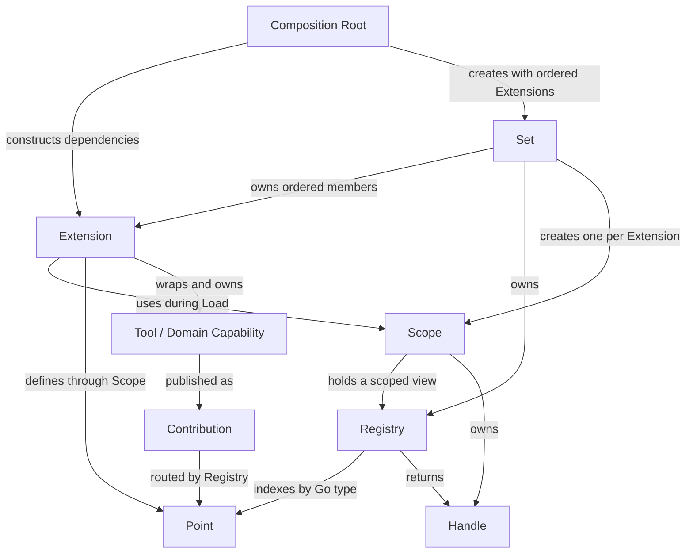

# 插件与资源架构

系统只有两个通用机制：`core/resource` 连接强类型资源，`core/extension` 管理固定生命周期。
业务依赖通过构造参数传递。系统没有 Extension ID、依赖 DAG、Service Locator、通用
Capability Catalog、实例声明 DTO 或类型化 ID 层级。

## Core Model



`Tool / Domain Capability` 是领域概念，不是新的通用 `Capability` 接口。Tool、Command、Skill、
Runtime 等业务对象保持独立、可直接使用，并构成真正对外的能力面。`pkg/exts` 中的 Extension
只是 harness adapter：持有需要生命周期管理的对象，在 Load 时将能力发布为 Contribution，
并在关闭时撤销注册、排空工作和释放所有权。业务代码不以 Extension 作为能力接口。

`Set` 按顺序 Load `Extension`；全部成功后冻结新的 `Point` 定义并发布 Active。关闭时按相反
顺序处理 `Extension`：先停止对应 `Scope`，再逆序关闭它拥有的 `Handle`，最后关闭 Extension
自身持有的后台工作和外部资源。构造参数表达直接业务依赖，`Registry` 只连接动态资源。

这张图只描述 runtime Extension model。Config、CLI 和 Probe 的 declaration registry 复用
`core/resource`，但发生在参数解析前，不由 `Set`、`Scope` 或 runtime lifecycle 管理，因此不属于
这张核心关系图。

## Typed Resource

资源类型就是 Go 类型。宿主定义 Point，插件贡献该类型的值：

```go
type Point[T any] interface {
    Add(...T) (resource.Handle, error)
}

resource.Define[tool.Tool](resources, tools)
resource.Add[tool.Tool](resources, read, write, glob)
```

`resource.Registry` 内部用 `reflect.TypeFor[T]()` 定位 Point，因此资源类型没有字符串名称，
也不存在需要同步维护的 Resource ID。资源自身的领域标识仍由领域类型负责，例如 Tool 的
名称、CLI flag、配置 section key 和 protobuf namespace full name；这些不是插件 ID。

定义资源类型也是动态组合的一部分。只有已经定义的类型可以接收贡献，完整 Profile 加载后
冻结新类型定义，但已有 Point 仍可接收和撤销运行时贡献。`Handle.Close` 撤销一个原子批次；
Tool、Command、Skill、Console、Namespace Binding 和 Web Route 均遵循此语义。Point
自己负责重复规则、快照、调用准入和排空，通用 Registry 不猜测领域行为。

资源定义顺序也是可见性边界：较早的 Extension 不能保留 Scope 后向较晚才定义的资源类型
注册。这样无需依赖图，也能阻止隐式反向依赖。

## 声明期资源

Config 与进程 CLI 在解析前组合，仍使用同一套 typed resource 机制：

- `config.Section` 由 `config.Sections` 接收。
- `cli.Contribution` 由 `cli.Registry` 接收。
- `probe.Definition` 由 `probe.Registry` 接收。

插件的 `Declare(*resource.Registry)` 直接贡献上述类型，不再汇总成 settings DTO，也不需要
伪造一个生命周期 Extension。声明批次在 Seal 前可以撤销；Seal 后形成一次解析使用的不可变
目录。CLI contribution 按注册顺序物化，因此一个插件可以扩展较早插件声明的命令。

运行时资源与声明期资源的差异只在领域约束：参数解析完成后不能热加 flag/config schema，
而 Tool、Command、Skill 等运行资源在 Point 存活期间允许热增删。

## Extension 生命周期

```go
type Extension interface {
    Load(*extension.Scope) error
}

set, _ := extension.New(commands, tools, skills, provider, files, terminal)
```

`Set` 按声明顺序 Load，失败时或关闭时按相反顺序处理。真正持有后台工作或打开资源的插件
额外实现 `Close(context.Context) error`；纯资源贡献插件只需 Load。没有 Entry、ID、DependsOn
或拓扑排序；构造函数参数表达业务依赖，切片顺序表达生命周期。

每个 Scope 提供：

- `Init()`：本次初始化 context。
- `Lifetime()`：Extension 开始关闭时取消。
- typed resource Registry：通过 `extension.Define/Add` 使用。
- owned handles：Scope 在调用 Extension.Close 前逆序撤销。

Profile 只有全部 Extension 成功加载后才 Active。Close 开始即停止发布，先取消 Scope、撤销
资源贡献，再调用 Extension.Close。`ErrCloseIncomplete` 表示资源仍未排空，Set 保留当前位置
和更早的依赖，允许使用新的 context 重试；普通错误会报告但不阻止其余逆序清理。

## 领域 Point

| 资源类型 | Point 所有者 | 贡献者示例 |
| --- | --- | --- |
| `tool.Tool` | Tool Registry | files、terminal、scanner、search、browser |
| `commands.Command` | Command Registry | terminal、scanner、native |
| `skills.Bundle` | Skill Library | IOA 及未来知识插件 |
| `*console/api.Bindings` | TUI | Session、IOA presentation |
| `aop.NamespaceBinding` | Namespace Catalog | Session、Proxy 等协议插件 |
| `web.Route` | Web route catalog | Management API、IOA server |
| `config.Section` | Config builder | IOA client/server、record |
| `cli.Contribution` | CLI builder | IOA commands、Session flags |
| `probe.Definition` | Config API builder | scanner、search、IOA probes |

Command 和 Tool 是不同执行协议，但共同使用 `core/registry.Store[T]` 管理批次、运行时准入、
取消和 drain。Skill 是知识资源，不并入执行 Registry。Console、Probe 和 Namespace Binding
也保留自己的领域类型，不通过字符串形式的万能资源表。

每个连接从 Namespace Catalog 绑定一次当前快照。关闭 contribution handle 会移除后续连接的
绑定，已建立连接仍由自己的 `aop.NamespaceMux` 和连接 context 管理，这避免运行期跨连接共享
可变路由状态。Namespace 的唯一身份是 protobuf full name；Mux 不再维护字符串 owner 或按
owner 注销的第二套生命周期，连接关闭时统一停止准入并排空已接受的 dispatch。

Session Extension 只拥有 Runtime 的启动和关闭，不探测 Namespace Point 是否存在。需要暴露
Session 协议的组合根显式贡献 `Runtime.NamespaceBindings()`；Node 连接也不再硬编码同一组
core/command handler。连接私有的调用取消在 Namespace 分发前处理，因为它依赖单个连接的
运行中调用表，不是可跨传输复用的资源。

## Service 与 Capability

旧 Service 表已删除。App、Session、IOA、Proxy 等依赖都由组合根直接构造并注入；业务对象
不暴露 Load/Close，拥有者 Extension 保留资源生命周期。可选依赖使用普通 nil/interface
字段表达，而不是服务查询或 capability gating。

旧产品 Capability Catalog 和 `pkg/edition` 已删除。Scanner CLI 元数据由 scanner 包自己维护；
Browser、Record 等功能是否存在由 build tag 和实际 Extension 组合决定。远端节点需要通告的
核心线协议能力仍保留在 `AgentHello.capabilities`，但由连接实现根据它实际支持的协议直接
生成，不再通过插件贡献 `node.Capability` 后二次投影。插件功能由实际注册的 Namespace、Tool、
Command 等资源表达，避免展示标签与真实可用功能产生两个事实源。

## 组合根

- `cmd/aiscan`：完整产品，按 build tag 选择 scanner、search、proxy、IOA、browser、record、Web。
- `cmd/agent`：最小本地 Agent，只包含 hooks/event stream、Tool/Command/Skill Point、files、bash、App、
  Provider、Agent loop、Session 和 TUI；依赖测试禁止引入上述产品功能。
- `pkg/runner`：保留共享的 aiscan 运行模式逻辑，不是可执行命令，也不改名。

两种可执行产品都只有一个线性 Set。App 不选择插件、不创建子 Set，也不关闭借用的资源。
新增插件时，在组合根中构造依赖并把 Extension 放到正确顺序；新增资源种类时先定义具体 Go
类型和领域 Point，再由基础 Extension 定义、后续 Extension 贡献。

## 事件与关闭

`core/events.Stream` 是 AOP 事实流，负责 Event ID、时间和序号。Hooks 负责控制与观察，
Operation 负责调用关联；它们不与资源注册或生命周期互相替代。Telemetry、Console、Web 和
Node 只消费实际事件。

关闭时入口先停止接收工作，Set 再逆序撤销贡献并排空调用。Registry handle 只影响自己的
批次，不会取消其他插件的调用。资源替换通过 Add 新批次和 Close 旧 handle 完成；整个产品
组合变化则构造新 Profile。
