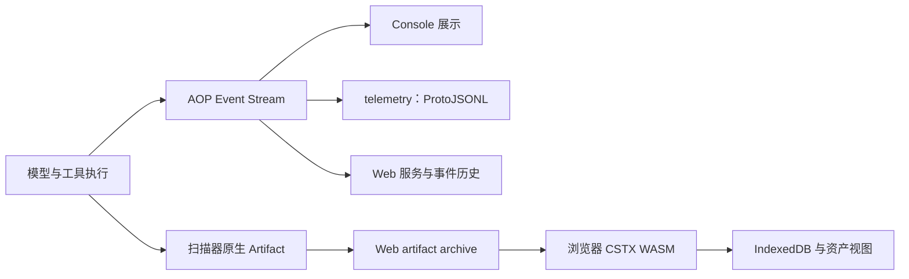

# 事件、记录与资产

[架构概览](../architecture.md) · 前一篇：[上下文与知识](context.md) · 接入：[宿主集成](../developer/hosting.md)

一次执行会产生对话、命令输出、状态、扫描产物和流量。理解各自的所有者，才能判断保存了什么、恢复了什么，以及 UI 中一个资产从哪里来。

## 控制与事件边界

| 机制 | 职责 | 示例 |
| --- | --- | --- |
| `core/hooks` | 执行边界上的控制与观察 | `process.before` 的准入策略 |
| `core/operation` | 调用身份、父子关联与取消传播 | tool → command → process 的关联 |
| `core/events.Stream` | 发布 AOP 事实事件及其 ID、时间、序号 | 消息、工具调用、工具结果、状态 |
| `core/eventbus` | 进程内的泛型通知机制 | 扫描 pipeline 的调度观察 |

这些机制不互相替代：AOP 事件不能承担准入，扫描调度事件不等于外部会话协议，操作取消也不能通过修改历史记录实现。

`--observe=tools,commands,processes,files,http` 选择安装的观测处理器；`-o` 负责保存运行时实际发出的 canonical 事件。保存事件不意味着未安装的观测项也会自动产生数据。

## 从实时执行到保存



同一个工具结果可以包含给模型的文本和独立的原生产物。模型可读文本可能被截断，资产提取应使用声明了类型/格式的产物，不应从一段自然语言总结反推扫描事实。

## CLI 的三类输出

| 入口 | 产物 | 用途 |
| --- | --- | --- |
| Agent `--output-format text/json/stream-json` | one-shot 的 stdout 展示/结果/事件 | 接 shell 或自动化消费者 |
| scan 的 `-j` 或单扫描器的原生输出选项 | 对应扫描器的原生结果 | 阅读、导出、下游处理 |
| `-o run.jsonl` | 新建的 AOP Event ProtoJSONL | 留存、回看、恢复对话 |

它们不是一个格式的别名。`-F` 回放接受事件记录，不意味着任意扫描器原生 JSON 都能作为会话恢复源。需要原生 stdout 时使用重定向；需要事件历史时使用 `-o`。

```sh
aiscan agent -p "读取当前目录并总结" -o run.jsonl
aiscan -F run.jsonl
aiscan -F run.jsonl --view-format markdown -f run.md
aiscan agent --resume run.jsonl -p "继续解释刚才的结果" -o next-run.jsonl
```

## 回看、恢复和重执行

回看是读取已有事件并渲染，不启动旧任务。恢复从历史建立对话上下文，再执行新的输入，不恢复操作系统进程、浏览器实例、IOA 连接或内存里的周期任务。重新执行则会再次调用工具并产生新的外部效果。

恢复源保持只读；`--resume` 不会隐式开启新的输出，也不会将后续事件写回旧文件。Web 的数据库历史与 CLI 的 JSONL 有不同存储入口，不能仅凭扩展名互换。

## AOP、Envelope 和 cursor

AOP 是 Agent 交互协议。跨连接传输使用 `Envelope`，payload 是 protobuf `Any`，按 protobuf 类型路由到 namespace；一个 payload 可以是命令请求，也可以是 `aop.Event`。

`Envelope.id` 标识操作，响应的 `reply_to` 指向请求；取消 operation 也指向该操作 ID。`Event.seq` 表示 Session 内的语义顺序；`delivery_cursor` 表示持久化投递位置，用于重连续读，两者不能互换。

WebSocket 使用 protobuf 二进制 Envelope，stdio 使用逐行 ProtoJSON Envelope；CLI 历史文件则是逐行 Event，不能拿来直接喂给 stdio transport。接入流程见 [教程](../integration.md)，字段契约见 [API](../api.md)。

## 产物归档与资产视图

当前 Web 路径中，Go 服务端归档完整的 `aop.tool.Artifact` event 和递增 cursor；浏览器通过 `@cyber/cstx` WASM ABI 解析原生产物，生成规范化的 IP、Port、Web、Vulnerability 等节点，在 IndexedDB 保存节点、operation 关联和消费位置。

原始归档是重建视图的输入；CSTX 节点是解析结果。Go 不再维护另一套平行 CSTX 事实表。仓库里的可选原生 CSTX 扩展不表示参考发行版会在后端做同样的解析。

因此，排查“扫描有输出但资产面板为空”，需要按原始 artifact 是否发出、是否归档、浏览器是否消费、格式是否支持、视图是否过滤的顺序检查；模型最终答案不能证明这条链路已经完成。

实现：[事件流](../../core/events)、[telemetry 扩展](../../pkg/exts/telemetry/extension.go)、[会话 JSONL](../../agent/session/session_jsonl.go)、[Web 存储](../../pkg/web/service/store_sqlite.go)、[浏览器 CSTX](../../web/frontend/src/lib/cstx-runtime.ts)。验证入口：[历史记录测试](../../agent/session/session_jsonl_test.go)、[artifact API 测试](../../pkg/web/api/artifact_test.go)。
