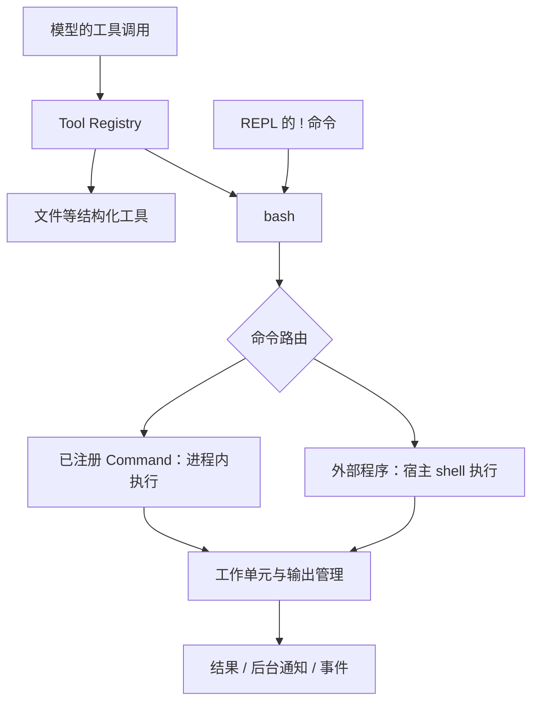

# 工具与执行环境

[架构概览](../architecture.md) · 前一篇：[Agent 运行时](runtime.md) · 下一篇：[上下文与知识](context.md)

模型请求一个工具之后，harness 必须把请求转成实际工作，并负责输出、超时和清理。本章沿这条路径解释 Tool、Command、进程和网络。

## 工具与命令的执行链

Tool Registry 暴露模型能看到的结构化工具定义；Command Registry 暴露命令行能力。`bash` 是 Tool，而 `gogo`、`spray`、`scan`、`proxy` 等可以是 Command。



简单内置命令直接进入注册表，不要求单独安装同名可执行文件。含管道等 shell 语法的命令由适配层连接内置命令与 shell。外部程序仍依赖宿主安装、PATH 和工作目录；`bash` 的名字并不提供一个容器或文件系统沙箱。

这种设计让模型沿用命令行知识，CLI 和 Agent 又可以调用同一个业务实现。新增扫描器通常先增加 Command，需要专门结构化交互时再增加 Tool。

## 等待与超时

以下是 Agent 向 `bash` 传递的 JSON 参数，不是启动 `aiscan` 的参数：

```json
{"command":"某个需要较长时间的命令","wait":5,"timeout":120}
```

| 参数 | 语义 |
| --- | --- |
| `wait: 0` 或省略 | 等待命令结束 |
| `wait: 5` | 最多在本次工具调用里等待 5 秒；未完成则返回后台 session ID |
| 省略 `timeout` | 使用工具默认总运行时间，当前为 600 秒 |
| `timeout: 0` | 显式不设置命令总期限 |
| `timeout: 120` | 总运行时间 120 秒，转入后台后仍然有效 |

后台命令定期把增量输出送入 Inbox，完成后投递完成消息。`tmux` 是这一工作单元管理的命令表面，可查询、读取、送键和停止任务；这里不要求系统安装同名 tmux 程序。模型可读的输出有截断限制，长输出应分段读取或保存为文件。

AOP 的前台工具执行等入口使用前台执行契约，不能把上面的 Agent 后台等待行为直接套到所有远程调用。Runner 也可以设置额外的前台超时上限。

## 工作单元与清理

工作注册表统一跟踪四种 attachment：`tty`（PTY 进程）、`pipe`（分离标准流的进程）、`func`（进程内函数）、`extern`（外部子系统持有的工作）。它们共享身份、状态、输出与停止接口，但只有 OS 进程才有 PID/退出码。

例如扫描器以进程内函数执行，即使没有非零退出码，也可能处于失败状态。调用端必须检查终态和原因，不能只看 exit code。PTY 适合交互终端，pipe 适合不能混入终端控制字符的协议字节流。

停止进程按 interrupt → terminate → kill 逐级推进。生命周期关闭还要排空执行、停止监视并回收子进程；取消工具调用不等于仅从界面移除一张卡片。

## 代理与 MITM

参考发行版安装 proxy 扩展，向其他扩展提供 `egress.Endpoint`。该扩展持有本地 Hub：工具使用稳定的本地代理地址，上游由 `proxy` 命令选择；`mitm` 命令查询捕获结果。最小本地 Agent 使用 `base.NoEgress()` 提供禁用路由的实现。

内置客户端接收出口配置；外部命令通过代理及 CA 环境变量接入。外部程序若忽略这些变量、自建连接或使用不受支持的协议，不能据此保证其流量被捕获。切换上游也不意味着已建立的 TCP 连接迁移。

默认捕获可用 `--mitm=false` 关闭，保留路由但停止 HTTPS 解密/抓包；HTTPS 捕获依赖客户端信任 Hub CA。LLM 请求的 `--llm-proxy` 是独立配置，不能和工具的 `--proxy` 混为一谈。具体命令见 [代理参考](../reference.md#代理proxy)。

## 执行能力的组合

浏览器、扫描器、录屏和外部工具安装各自拥有运行资源，通过扩展贡献工具或命令。它们共享执行和观察路径，但不会因为注册到同一个框架就获得相同的运行环境。发行版和平台决定实际可用能力，使用层面的选择见[工具与环境](../user/tools.md)。

实现：[bash 路由与后台通知](../../tools/terminal/bash.go)、[终端扩展](../../pkg/exts/terminal/extension.go)、[命令注册表](../../core/tool)、[代理扩展](../../pkg/exts/proxy/extension.go)。验证入口：[命令执行测试](../../tools/terminal/bash_test.go)、[工作单元测试](../../tools/terminal/process_test.go)。
