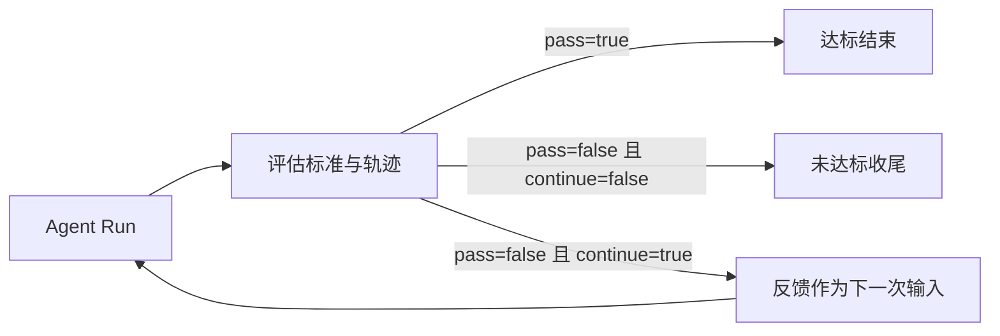

# Agent 运行机制

[架构概览](../architecture.md) · 前一篇：[扩展装配](composition.md) · 下一篇：[执行环境](execution.md)

本章解释一次任务怎样推进与收尾。使用命令见 [Agent 指南](../agent.md)，参数默认值见 [参考手册](../reference.md)。

## Session、Run 和模型轮次

Session 保留对话和运行状态，使下一次输入可以继续使用历史。一次 `Agent.Run` 把输入加入对话，调用所选的 `agent.Loop`；标准实现是 `StandardLoop`。它每轮请求模型，执行返回的工具调用，再把结果加入下一轮请求。

宿主协议的 Turn 是外部提交与取消的单位，内部模型轮次是循环计数。启用 Goal Evaluation 时，一次任务可能执行多次 Run。统计或接入时不要把三者的计数混用。

配置级变更整体替换 Profile。终端 `/model` 仅修改当前 Session 下一次 Run 的模型；已运行任务和已有子任务保留各自快照，清空、压缩与恢复当前会话继续沿用该模型。`/provider` 只查看配置，终端不再原地修改全局 Provider。

取消受理不代表执行已经退出。正常取消的 `TurnEnded` 由 Runtime 在执行结束后发布，携带最终 usage 和错误；Web 只在派发失败、断连或自身停止等待时提供兜底终态。

Scanner 将 verify/sniper 注册到 subagent 扩展唯一的 `Subagent` Point，通过注入的 Worker 按名称同步执行，独立 CLI 不需要创建 Runtime Session。调用来自 Agent 或 Session 命令时继承当前模型快照，否则使用 Profile 配置。它与普通 subagent 共用 `Config.ForTask`，隔离历史、Inbox、调度器和事件计数；scan 返回前等待子任务退出，调用取消或所属 Profile 关闭会取消子任务。AOP 中的子任务 Session/Turn 事件仅用于委派追踪，不注册对话队列、IOA 接收器或后台续跑。

## Subagent 委派

subagent 是可选扩展，不属于 Agent 配置或 Session 内建工具。`subagentext.New()` 拥有唯一的
`resource.Point[subagent.Subagent]`；`NewTools()` 借用该 Point 和 Session Runtime 安装统一工具。
注册名 `name` 可选：省略执行匿名任务，具名执行注册的 Prepare。`label` 标识本次运行的可读名称，
`session_id` 用于唯一定位与取消。`catalog` 列出当前定义，`list` 列出运行实例。

具名定义可以在运行时增加与撤销。租约覆盖准备、执行和收尾，撤销取消关联任务并等待排空，
之后才允许同名注册。Session 仅提供通用附属会话、单任务模式与关闭完成回调；
subagent 在最终记录之后发送完成通知、释放父 inbox producer。完整职责与调用约定见
[Subagent 扩展](../../pkg/exts/subagent/README.md)。

## 标准循环

1. 检查 Provider 和执行上下文，解析本次 Run 的 system prompt，再执行 `BeforeRun` hook。
2. 每轮先排空 Inbox，将追加消息转换为对话内容。
3. 根据历史、工具定义和上下文窗口判断是否需要压缩。
4. 请求当前 Provider；可重试错误在当前 Provider 内重试。
5. 校验模型返回的工具调用，检查 token 预算，执行有效调用。
6. 按模型给出的调用顺序追加工具结果，检查结束条件；必要时进入下一轮。

这使得追加输入在轮次边界被处理，而不是修改已经发送给模型的请求。system prompt 则在一次 Run 开始时固定；下一轮工具结果和 Inbox 消息属于变化的对话部分。

## 工具并发与错误

同一模型响应里的工具调用可以并行执行，默认并发上限为 16；完成后按原调用顺序写回结果。模型必须把依赖前一次输出的工作放到后续轮次，同一批调用之间没有隐式依赖排序。

输出因长度限制被截断时，该响应里的工具调用不会执行；缺少调用 ID、名称或有效 JSON object 参数的调用也会被拒绝。错误结果返回模型，允许它重新生成完整参数。工具 panic 被隔离并转成失败结果，避免直接跨越执行边界。

模型请求失败、单个工具失败和用户取消是三种不同情况。工具失败通常仍可进入后续推理；不可恢复的 Provider 错误结束 Run；取消通过 context 向执行中的工作传播。

## Inbox 与后台生产者

用户追问、后台命令完成、子 Agent 回报和 IOA 消息都可以通过 Inbox 回到会话。队列有容量和优先级；满队列可能用高优先级消息替换低优先级消息，无法接收时返回错误。它不承诺离线保存或无限堆积。

后台工作注册 producer，完成后释放。模型没有再请求工具时，循环先检查待处理消息；若还有活跃 producer，调用 `WaitWhileActive` 等待消息或取消。producer 全部结束且没有消息时才自然收尾。因此，异步任务能在模型暂时无事可做时把后续结果送回来。

持续运行的 `/loop` 调度也注册 producer。它按 interval 或五字段 cron 把任务提示投入 Inbox，由模型处理；这不是绕过模型的 OS 定时执行器。最小 interval 默认 10 秒，进程/会话结束后不承诺恢复计划。忘记停止一个周期任务可能使循环一直等待。

主会话的 heartbeat 也通过调度器安装，提示模型检查当前上下文与活动工作。它与传输层的连接保活不同，会产生实际的 Agent 输入。

## 子 Agent 的派生

`agent/session` 的子代理工具由现有 Session 扩展安装，直接使用 `OpenSession → RunSession → CloseSession`。Session 拥有 Inbox、取消、生命周期事件和最终记录；工具没有独立的运行表或关闭流程。本地子 Agent 也通过这套循环执行。派生时沿用父配置中的 Provider、工具等能力，但拥有自己的对话与 Inbox。`sync` 在当前调用中等待；`async` 从新对话开始，`fork` 则截取父对话的完整消息边界作为起点。Agent 类型可以补充指令、模型等配置。

异步子任务向父 Inbox 注册 producer。关闭 Session 时先完成 IOA 最终记录，再向父 Inbox 投递一次结果并释放 producer。父 Session 关闭会取消并等待子 Session；单次工具调用返回不会取消后台子任务。父循环由此知道仍有工作可能返回，而不是只根据当前模型有没有输出判断结束。子任务的进程内配置继承不提供文件、网络或浏览器隔离；它和跨进程 IOA 消息投递也属于不同生命周期。操作方式见[子 Agent](../user/web.md#子-agent)。

## 停止条件

| 停止原因 | 触发条件 | 对使用者意味着什么 |
| --- | --- | --- |
| `completed` | 模型无工具调用，且没有待处理输入或活跃生产者需要等待 | 当前推理自然结束 |
| `terminated` | 工具批次满足终止条件，例如单独调用 `finish` | 显式声明本次运行结束 |
| `stopped` | 达到配置的模型轮次上限 | 因限制停止，不代表目标已达成 |
| `budget` | 本次运行的累计 token 用量达到预算 | 预算耗尽，与上下文窗口不是一回事 |
| `canceled` | context 被取消 | 用户或上层停止执行 |
| `error` | 无法继续的执行错误 | 需要检查错误原因 |

`finish` 与其他非终止工具同批调用时不会立即结束整个批次；当前实现要求批次结果全部请求终止。达到轮次限制的检查也发生在自然完成判断之前。接入端应读取停止原因，而不是仅根据最终文本判断任务成功。

## Goal Evaluation

`-e` 或 `/eval` 设置验收标准。Agent 完成一轮工作后，评估器通过单独的模型调用检查轨迹摘要、输出和此前反馈，返回 `pass`、`continue`、`reason`、`feedback` 等结构化字段。默认配置使用当前 Provider/模型；“独立评估”不意味着自动换另一家模型。

`--eval-rounds` 是评估轮次控制：纯数字设置硬上限；自然语言交给评估器理解，并由预算解析保留防止无限执行的上限；默认上限为 20。它不是单次 Run 的模型请求上限。

评估器短暂调用失败时注入通用反馈；连续三次失败或最后一轮仍失败会返回错误。评估器选择不继承上下文时，会尝试压缩，失败再重置上下文。评估未通过但选择收尾，或达到评估上限，都可能正常返回最后结果，所以“进程正常退出”和“通过验收”需要分别判断。

## 运行轨迹

用 `-o` 记录事件，再检查消息、工具调用、结果、状态与结束原因。长时间不结束时先检查后台命令、subagent、周期任务；反复同一错误时区分模型请求重试与模型主动重试工具。上下文与重试策略见 [下一层机制](context.md)。

实现：[循环](../../agent/loop.go)、[Inbox](../../agent/inbox/inbox.go)、[调度器](../../agent/loop_scheduler.go)、[评估器](../../agent/evaluator/loop.go)。对应测试：[循环](../../agent/loop_test.go)、[工具调用](../../core/tool/tool_call_test.go)、[Inbox](../../agent/inbox/inbox_test.go)、[评估反馈](../../agent/evaluator/loop_test.go)。
