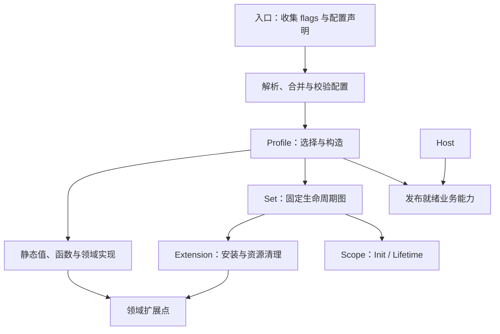

# Profile 静态装配与 Extension 生命周期

设计 Issue：[#129](https://github.com/chainreactors/cyber-harness/issues/129)。关联 #122、#123、#127；外部 ACP/Pi 集成由 #124 跟踪。

本文记录本轮实现的装配契约。Scope、领域注册接口、Profile 与 App 已按下文收敛；具体测试结果单独记录，不将设计约定视为全仓验证完成。

## 1. 概念与责任

正式命名只使用 Extension（扩展），不增加独立 Plugin 层。Go 包组织功能，静态声明通过普通值和函数提供；需要初始化或清理的部分才接入生命周期。

| 概念 | 责任与形态 |
| --- | --- |
| 扩展点 | 领域允许外部提供声明、实现或处理器的位置；使用构造参数、函数、小接口或领域注册方法 |
| 贡献 | 向扩展点提供的具体内容，不新增通用 Contribution 类型 |
| Extension | 执行一次安装及其清理，可同时贡献多个领域能力 |
| 资源与所有者 | 文件、连接、订阅、挂载、后台任务由一个最终责任方停止、排空和释放 |
| 借用 | 普通引用或接口参数，不转移资源关闭权 |
| Scope | 一次 Extension 安装的初始化上下文与运行寿命信号 |
| 业务依赖 | 构造参数表达使用哪个对象或函数 |
| 生命周期依赖 | Entry.DependsOn 表达先就绪、后释放的关系 |
| Set | 固定图的加载、发布、回滚和关闭执行器 |
| Profile | 选择功能、构造依赖、声明图并发布业务能力的具体产品装配代码 |
| Registry / Catalog | Registry 持有领域声明并管理执行；Catalog 只描述能力，不接纳执行 |
| Host | CLI、Web、Node 等实际入口，负责自己的监听、连接与请求寿命 |

所有者、借用、贡献是职责描述，不各自建立框架类型。业务可见范围仍由领域决定，不放入 Scope，也不预建通用 Scope 树。



## 2. 扩展点开放，不限定于 Tool/Command

| 扩展内容 | 接入方式 | 所有者与生效阶段 |
| --- | --- | --- |
| Flags、子命令参数、help | 类型化 Options、现有 config.FlagGroup、普通声明函数 | 入口在解析前收集，不构造运行资源 |
| Config 字段、默认值、环境变量映射、校验 | 普通 Config/Options struct、现有加载与解析函数 | 入口解析，Profile 转换为具体功能配置 |
| 静态 Skill Bundle、Prompt、模板、协议类型、展示元数据 | Go 值、嵌入资源、函数返回值 | Profile 直接选取和注入，不实现空生命周期 |
| Tool、Command、编解码器等固定声明 | 领域 Register 方法 | Profile 独占 Registry 整体持有 |
| Provider、存储后端、策略、算法、格式化器 | 构造注入的小接口、函数或具体业务对象 | 消费领域调用；需要初始化或清理的实现由 Extension 持有 |
| Hook、事件消费者、连接任务 | 领域订阅句柄与业务回调 | 实际所有者停止准入并排空 |
| HTTP/AOP namespace、Console 命令与渲染绑定 | 普通宿主绑定函数或宿主已有接口 | 宿主安装固定绑定并排空请求；不新增通用扩展点枚举 |

这些是接入方式示例，不是中央能力清单。新领域无需修改 core/extension，亦不要求其他扩展实现新方法。单一实现直接注入；只有确有命名查找或多实现选择需求时才增加领域 Registry。

### Flags 与 Config 的启动顺序

```text
入口声明支持的选项 → 解析 CLI / 配置 / 环境变量 → 校验与默认值
→ Profile 选择实际运行功能并构造依赖 → Set.Load → 对外服务
```

参数必须先声明才能解析，不能等 Extension.Load 后才提供 help 或配置字段。声明支持哪些选项与是否启用对应运行资源是两件事；不为此增加两阶段插件发现或插件工厂协议。

当前直接复用：

- `config.FlagGroup`：Name、Description、绑定到具体 Options 的指针。`agent.FlagGroups` 已能与其他组组合，help 和参数解析无需 App 或已加载 Extension。
- `config.Option` 的组合字段、config/default 标签，以及现有配置模板生成逻辑。
- 扩展自有配置段使用配置领域的 Section/Sections 声明与解码入口，由产品收集；配置键只定位配置数据，不用于取得运行服务。底层解码边界可以使用 any，功能实现仍接收具体 Options/Config。
- `ResolveRuntimeConfig` 的加载、环境变量、归一化和默认值流程；保留现有 CLI、环境变量、文件和默认值优先级及显式零值语义。
- Profile 的普通配置转换函数，把解析结果传给功能构造函数。可单独测试的校验和转换使用普通函数，不增加配置服务定位。

新增配置字段时同步其所属 Options、必要的合并/校验规则与测试。并非每个字段都要提供 flag，也不要求每个有配置的功能实现 Extension。配置值更新继续由领域负责；改变 Extension 组合则构造新的 Profile。

## 3. 单次装配与整体关闭

```text
构造与声明注册 → 整组 Load → 固定运行 → 整组 Close
                   ↓ 失败
               回滚并废弃当前组合
```

每个 Profile 独占其 Registry 和资源实例。失败组合不发布，不删除某个失败节点后继续运行，也不复用失败的注册表。已打开资源显式关闭；未发布的纯内存声明随失败组合废弃。

纯注册的 `pkg/exts/tools`、`pkg/exts/commands` 包已删除。Subagent Tool、Loop/Proxy/Arsenal Command 直接在 Profile 构造期间注册。Files、Terminal、Scanner、Search、IOA 等仍可在 Load 中完成依赖资源就绪后的注册，不强迫把初始化工作提前到构造函数。

具体 Profile 直接以具名字段持有 `*extension.Set`；原 `profile.Assembly` 包装已删除。保留 `pkg/profile.Application`、Factory、Request 的产品契约。一个 Profile 一张图，不意味着整个进程只能有一张图：Web 宿主基础设施与应用可以具有不同寿命，外层宿主负责保证跨图借用的寿命。

`app.New(config, deps)` 返回 `(*Resource, error)`，必须显式传入 Hooks、Events、Commands、Tools；缺失即报错。App 不补建共享 Registry，也不关闭借入的 Registry。Logger 等普通默认值和可选 Bash/Scanner 保留。

## 4. 最小生命周期接口

```go
type Extension interface {
    Load(*Scope) error
    Close(context.Context) error
}

type Entry struct {
    ID        string
    DependsOn []string
    Extension Extension
}

func (s *Scope) Init() context.Context
func (s *Scope) Lifetime() context.Context
```

Scope.Track 及其 effect 回收分支已删除。Scope 不接管资源，不提供服务查找、公开 Close 或嵌套生命周期。

- Init 仅约束 Load；运行任务不继承初始化取消。
- Lifetime 在对应节点开始关闭时取消，不表示排空完成。
- Close(ctx) 的 ctx 是当前清理预算。普通调用仍显式传自己的 context。
- 对应 Extension.Close 负责订阅排空、协程等待和资源释放；输出消费者按自身契约完成已接纳输出，不提前被寿命取消截断。

关闭顺序：撤销完整图发布状态 → 选择可关闭的依赖者 → 取消该节点 Lifetime → Close 排空并释放 → 完成后允许关闭依赖。不能开头取消全图全部节点，否则生产者最后事件可能失去消费者。

现有 Set 保证继续保留：固定图校验、串行生命周期、并发关闭保护、实例归属检查、Load/Close panic 隔离和关闭重试。重复 Load 已激活的 Set 仍为幂等，不重新初始化；失败或进入关闭后不允许再次 Load。

Close 返回 nil 或普通错误表示资源回收完成，普通错误仍需报告；context 取消/超时或 ErrCloseIncomplete 表示尚未完成，依赖继续保留，无关分支仍可清理。后续使用新的 ctx 重试，不恢复服务、不重复释放已完成节点。

## 5. 固定注册与依赖保护

```go
func (r *toolset.Registry) Register(tools ...tool.Tool) error
func (r *commands.Registry) Register(group string, commands ...commands.Command) error
```

领域注册不再接受 Scope 或保存逐批撤销句柄。批次原子性、冲突检测、分组顺序、定义快照和激活后不可变行为保留。底层 Store 的批次撤销能力及其测试先保留，产品的固定 Registry 不再使用返回句柄。

Registry 持有声明，不取得工具或命令背后资源的关闭权。调用必须通过领域执行边界取得准入；关闭先拒绝、取消并等待在途调用，再清理声明。

构造引用与生命周期边不必同向。例如 Files 在 collecting 阶段向 Tool Registry 注册，但真正执行时 Registry 需要 Files 和 Skills 保持可用：

```text
Load：  Files → Skills → Tool Registry → Agent
Close： Agent → Tool Registry 排空 → Skills → Files
```

因此 Registry 依赖资源贡献者。workspace 的 Tool Registry 在选择 Skills 时显式依赖 Skills，防止关闭超时后挂载提前释放。删除纯声明节点时，依赖直接保护真实资源，不能同时删掉必要的寿命路径。

Hook Subscription 的 Cancel 停止新回调，Close 等待已有回调；EventBus Subscription 的 Cancel 会丢待处理队列，Close 才用于排空。两者不归并成通用 Stop/Close Effect。Session 临时订阅和注册到更长寿命对象的绑定，仍由实际所有者保存句柄并显式清理。

## 6. 与 DSH/Pi 的取舍

DSH 用 Context/Proxy 把当前 Fiber 归属带入领域 register，并具有动态服务和作用域机制。本方案以普通 Go 装配和固定组合减少此类框架需求。学习其多领域贡献与明确所有者，不复制动态插件树、服务驱动重装载或通用作用域继承。

DSH 顶层 Fiber 回收使用并行等待，不能视为本仓库的可重试依赖保护；这里继续由 Set 与领域 Close 保证安全关闭。Pi 的注册入口同样是设计参考，不据此建立包含所有扩展点的 PluginAPI。

参考：[DSH 注册归属](https://github.com/deepseek-ai/deepseek-harness/blob/b2e3b2a0125854567a4a5fcba75782e42fe84901/packages/core/scope/src/store.ts)、[DSH Fiber](https://github.com/deepseek-ai/deepseek-harness/blob/b2e3b2a0125854567a4a5fcba75782e42fe84901/vendor/cordis/src/fiber.ts)、[Pi 扩展加载器](https://github.com/badlogic/pi-mono/blob/main/packages/coding-agent/src/core/extensions/loader.ts)。

## 7. 验证约定

- 注册原子性、激活后封存、分组及定义快照保持一致。
- 多领域贡献部分安装失败时不发布；已打开文件和 Hook 订阅回收，新组合不复用失败 Registry。
- 初始化取消与 Lifetime 分离；依赖者 Close 未完成时依赖仍存活。
- 在途工具调用未完成时 Skills 挂载不释放；Close 重试完成后释放。
- Hook 最后事件、EventOutput/IOA 已接纳队列仍按领域契约处理。
- App 缺少共享依赖立即报错；Profile 仅发布完整图。
- Flags 可独立组合与生成 help；配置默认值、来源优先级和候选配置解析沿用现有行为测试。
- 默认/full 构建及相关并发清理测试；架构测试约束职责与依赖，不强制旧包装名称存在。

本轮未建设运行时单节点卸载、DI、配置服务、统一扩展点目录或资源安全包装；已有领域锁与完备机制不做机械删除。

### 本轮验证记录

- 默认与 full 全仓 `go build -mod=readonly` 通过。
- 根目录架构测试通过；允许同一功能内部的 CLI、配置和展示子包互相引用，仍禁止跨功能 Extension 依赖。
- `core/extension`、`core/registry`、`pkg/app`、Tool/Command Registry、`pkg/exts/...` 与 `cmd/runner` 的 race 测试通过；full 相关扩展测试通过。
- 本轮先前的 App/Profile/CLI 与 Console/Node/Web 测试通过。工作区随后同时发生 IOA 配置与入口迁移，当前 `core/config`、`cmd/aiscan` 部分测试仍引用旧 IOAOptions、IOAURL、Space、DefaultIOAURL 等字段，最终入口测试尚待这些调用点迁移完成后复验。这不构成全仓测试通过的声明。
