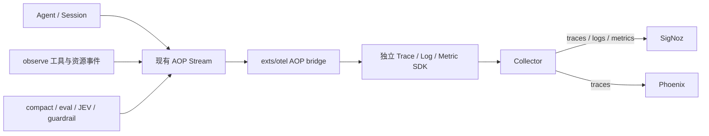

# Agent 可观测性：现有 AOP 接入 OTel

状态：2026-10-11，工作区已实现 traces / logs / metrics 并完成 SigNoz / Phoenix 本地验收。本文的验收记录来自本地工作区，测试和验收脚本保留在本地。运行方式见[接入示例](../examples/observability/README.md)。

现有 AOP 是采集输入，`exts/otel` 是转换和导出边界。Agent、工具和机制继续发布已有事件；OTel 扩展解释这些事实，生成兼容 GenAI / OpenInference 的 span、关联日志和指标。经同一个 Collector，traces 写入 SigNoz 和 Phoenix，logs / metrics 写入 SigNoz。

这次重构没有新增 AOP namespace、观测协议、模型协议、生命周期 helper 或业务侧 OTel hooks。AOP protobuf 和生成器保持原样，trace/span ID 由 OTel SDK 在消费时生成。AOP 仍服务于原有 UI、归档、回放和扩展通信。

## Pi 参考

主要参考 [NikiforovAll/pi-otel](https://github.com/NikiforovAll/pi-otel/tree/bf00f530d3667375a5317a0f425d0918e6cfac7e)，并对照 [stnly/pi-otel](https://github.com/stnly/pi-otel/tree/398d40a72a1ba3a599e8596f26c3f148df1e7296)。两者是 Pi 生态扩展，各自有独立实现。

| Pi 的做法 | Cyber 接入方式 |
| --- | --- |
| interaction / LLM / tool 生命周期 | 消费已有 Session、Turn、llm_request、operation 生命周期 |
| assistant 消息完成与稍后到达的 usage 分开 | LLM 优先结束于 assistant 消息时间，避免计入工具耗时 |
| 按 call ID 关联并行工具 | 使用已有 operation.Ref 的 operation_id、parent_operation_id、call_id |
| compact/retry/cancel 与因果关联 | 解释现有 status、typed Any、失败和 delegation 信息；缺失事实标注未知 |
| OpenInference / GenAI 与内容开关 | bridge 同时投影，业务层不引入产品 SDK |
| metrics/logs | 在同一 AOP 消费边界投影；与 traces 共享 Resource 和关联上下文 |
| shell W3C 传播 | 当前尚未实现跨进程传播 |

字段参考 [semantic-conventions v1.43.0 GenAI 属性](https://github.com/open-telemetry/semantic-conventions/blob/89aae438b3b3b0a8dd33003c9d70592baf7dbd0d/docs/registry/attributes/gen-ai.md)。GenAI 定义仍在演进，SDK 与语义字段版本分别管理。使用 OpenAI-compatible 网关不等于模型供应商是 OpenAI。

## 代码边界

| 文件 | 职责 |
| --- | --- |
| [extension.go](../exts/otel/extension.go) | 订阅、clone、队列、独立 SDK、exporter、Flush/Close 与错误反馈 |
| [bridge.go](../exts/otel/bridge.go) | AOP 关联状态、父子关系、来源 links、完成上下文与去重缓存 |
| [events.go](../exts/otel/events.go) | 原有 Session / Turn / operation / LLM / usage 转换 |
| [mechanisms.go](../exts/otel/mechanisms.go) | 原有 compact/eval/budget status、JEV RuntimeEvent、guardrail Review 适配 |
| [signals.go](../exts/otel/signals.go) | 包装 span 投影，按开始/结束生成日志、计数和耗时；独立于 trace 采样 |
| [lifecycle.go](../exts/otel/lifecycle.go) | Session 生命周期与 accepted AOP fact 日志；选择相关 trace/span |
| [providers.go](../exts/otel/providers.go) | 独立 Log/Metric SDK、OTLP 路径、导出错误与订阅丢弃反馈 |

转换器只接收 `*aop.Event`，不读取 Agent、provider、hooks、调用栈或其他扩展运行时对象。JEV/guardrail 根据现有 Any full name 和已注册 protobuf descriptor 解码；OTel 生产代码不导入它们的实现。未识别或未注册的扩展保留为 AOP fact，并记录 type name。

## 现有事实的映射

| AOP 输入 | OTel 输出与语义 |
| --- | --- |
| SessionStarted / SessionEnded / DelegationDetail | 保存 model、父 Session/call、Agent 类型与运行模式；记录 started/completed 日志、活跃数与生命周期耗时；不创建长期 Session 根 span |
| TurnStarted / TurnEnded | `agent.turn` AGENT，stop_reason、context_tokens、最终错误和汇总 usage |
| operation.Started / Completed + Ref | tool / command / process 等 span；按显式 parent_operation_id 关联；Completed.StartedAt 支持缺开始事件的重建 |
| Completed.Failure | 执行 ERROR、failure.kind、异常事件；无 StartedAt 且未见 Started 时标记 start_missing，不假装工具实际开始执行 |
| llm_request + LLMRequestDetail | `llm.<model>` LLM/CLIENT，模型、消息数、max_tokens、stream、消费侧请求序号 |
| assistant Message + Usage | 消息时间用于结束模型，usage 到达后补计量；未见响应时结束时间标记 estimated |
| compact_start/end/error + CompactDetail | `agent.compact` CHAIN，压缩前后 context tokens、保留消息数、错误 |
| eval_start/end/error + EvalDetail | `agent.eval` CHAIN，round/max_rounds/pass；pass=false 不自动标为运行错误 |
| token_budget_warning + BudgetWarning | 结构化事件，包含 context_tokens 和 token_budget |
| Recap | 已完成展示文本对应 AOP fact，不虚构模型调用或耗时 |
| JEV DecisionRequest / DecisionResult | `jev.decision` LLM，request_id、purpose、usage、错误；可能包含内部 HTTP 重试，标记 logical_request |
| JEV Generation | 按 request_id / parent_request_id 建立层次；compiler_round、claim_llm、parameters_llm 等模型事实计量；validation 为 CHAIN |
| JEV reflex_llm | 编译汇总 CHAIN，usage 仅用 cyber.tokens.*；不再次累计 compiler_round 的标准 token |
| JEV observation / dispatch / result / handoff / library change 等 | 前台为 AOP fact，后台为带来源关联的即时 span |
| guardrail Review pending / resolved | `guardrail.review` 等待 span，action/state/resolution_source；拒绝、过期、取消是策略 outcome，工具 Failure 另行表达 |
| 其他 file / HTTP / 扩展事实 | 附到明确的活动 operation 或 Turn；迟到事实保留来源，不延长已结束 Turn |

## 关联、后台与重复事件

工具、命令、进程用 operation ID 索引。已结束操作的 SpanContext 暂存，因此父操作导出后到达的子操作仍可关联。父 Started 从未观察到且无可用上下文时退回 Turn 并标记 parent.missing，不虚构父 span，也不事后修改已导出的父关系。

同步子 Agent 用 SessionStarted.parent_session_id / parent_tool_call_id 查找父工具并加入同一 trace。background delegation 新建 trace，link 到父工具。缺父工具时保留业务父 ID 和 missing 标记。context_mode=fork/fresh 作为属性保存，不等同于前台/后台运行模式。

JEV background=true 不表示源 Turn 仍在执行。后台 request 新建 trace 并 link 到已知源 Turn，compiler rounds 按 parent_request_id 加入编译 trace。源 Turn 未观察到时独立运行并标记 source.missing，不伪造 TurnStarted。完成的 Turn 不因迟到事件重开；迟到 fact 使用即时 span 和来源 link。

标准 OTel links 同时投影 `cyber.source.trace_id` / `cyber.source.span_id` 属性。Phoenix 20.20.0 的 REST/GraphQL Span 接口不暴露 links，因此验收检查 SigNoz 原生 links 和 Phoenix 来源属性，不宣称已验证 Phoenix 原生 link 展示。

event ID、完成 Turn、完成 scope、结束 Session、call → context 缓存各保留最近 4096 个身份。窗口内重复 ID 和重复 completion 不重复导出；缓存淘汰后不保证任意历史重放的全局幂等。它不是持久账本。消费者按交付顺序处理，保留 Event.seq 属性，当前不实现任意乱序重排。

## 模型计量

普通请求只在对应 LLM span 写入 `llm.token_count.prompt/completion/total` 和 `gen_ai.usage.input_tokens/output_tokens`。Turn 总计只用 `cyber.tokens.*`，避免根和叶重复累计。

主循环 Usage 可能汇总重试。连续请求或 `usage.detail.requests > 1` 时，请求 span 标记 usage.missing，不把所有 tokens 归给最后一次请求。汇总一次写在 `llm.retry_usage` CHAIN accounting span，标记 `cyber.usage.scope=request_group`。trace 总量需要对所有带标准计数的 span 求和，不能只筛 LLM kind。这是 OTel 投影，不是新增 AOP 事件。

`cache_read`、`cache_write`、`reasoning` 分别投影到 GenAI cache read、cache creation、reasoning token 属性，原 detail 保留在 `cyber.usage.detail.*`。`usage_missing` 保留为未知覆盖信息，没有 usage 时不写虚构的 0 tokens。

compiler_round 是 JEV 编译的模型计量来源；reflex_llm 汇总永远不再次写标准计数，包括汇总先到、round 后到的情况。旧版只有汇总的记录展示 cyber.tokens.*，无法证明原子调用覆盖。decision 和其他 generation 的 usage 口径来自原有事件，不声称已拆分内部 provider attempts。

## 日志、指标与 Agent 生命周期

每个窗口内去重后的非流式 AOP fact 生成一条结构化日志，保存 event ID、seq、Session/Turn、类型和已有执行元数据。scope 开始/结束另外生成投影日志，区分收到的事实与推导的生命周期。日志带唯一 `cyber.log.id`；Turn、模型、工具、机制日志关联相应 trace/span，迟到事实使用保留上下文。Session 开始尚无 Turn 时用 Session ID 关联，不伪造 trace。这不是对任意应用 stdout 或现有 logger 的自动采集。

Session 日志为 `agent.session.started/completed/incomplete`，Turn 为 `agent.turn.started/completed/incomplete`。完成日志的 `cyber.outcome` 表达 success / error / canceled / incomplete；guardrail 另支持 rejected / expired。Close 为未完成 Session、Turn 和 scope 收尾，保留 incomplete 而不记作成功。工具失败不会自动把最终成功的 Turn 记作失败。Session 记录是否观察到关闭及 reason，执行错误归属具体 Turn/scope。

| 指标 | 口径 |
| --- | --- |
| `cyber.aop.events` / `cyber.otel.events.dropped` | 已消费且去重的事实 / Flush 或 Close 观察到的订阅丢弃 |
| `cyber.agent.sessions` | Session 生命周期转换，按 `cyber.lifecycle.state` 区分 started / completed / incomplete；不能把开始和结束相加当 Session 数 |
| `cyber.agent.sessions.active` / `cyber.agent.session.duration` | 已观察到开始且未关闭的 Session 数 / 生命周期秒数 |
| `cyber.agent.turns` / `.active` / `cyber.agent.turn.duration` | 完成 Turn 数与 outcome / 活跃数 / 秒数 |
| `cyber.scope.completed` / `.active` / `.duration` | tool / command / process / compact / eval / guardrail / JEV 等 scope 的完成、活跃和秒数 |
| `cyber.model.requests` / `cyber.model.usage.missing` | 观察到的模型请求及未报告完整 usage 的请求；不计 accounting 或编译汇总为请求 |
| `cyber.model.tokens` | 标准叶子或 accounting usage；`gen_ai.token.type=input/output/total`，总量只筛 total，不能将三个类型相加 |
| `gen_ai.client.operation.duration` / `gen_ai.client.token.usage` | 模型耗时秒数 / input、output token histogram；估算结束时间在 trace/log 标注 |

指标只使用有限的 scope kind、outcome、state、token type、usage scope 和配置中的 model 标签，不把 Session/Turn/operation ID 或任意命令文本放入指标维度。三个信号共享 `service.name`、每个扩展实例的 `service.instance.id` 和 project Resource，可通过 `ResourceAttributes` 覆盖；示例用 run ID 隔离验收。日志/指标在 span 投影时产生，关闭 trace 采样仍保留生命周期和 usage；这时日志中的有效 trace ID 不保证有已导出的 trace。

设置 `Options.Endpoint` 默认启用三种信号，分别发送至基地址的 `/v1/traces`、`/v1/logs`、`/v1/metrics`。嵌入宿主可设 `DisableLogs` / `DisableMetrics` 或传入独立 exporter。无 Endpoint 时只启用显式传入的 exporter，仍需提供 trace exporter。MetricInterval 默认 10 秒；Flush / Close 也导出一次，支持短任务。扩展拥有所有传入 exporter 的关闭生命周期。

## 内容、队列与关闭

默认导出关联、执行元数据和 usage。`CaptureContent=true` 才导出消息、机制 output、delegation task 和事件 payload，截断到 4096 字节边界并保持 UTF-8；截断 payload 作为文本，不保证仍是完整 JSON。没有新增自动脱敏或内容分级系统。

input 是最近用户消息，不是 provider 最终有效请求快照。delta 和 raw provider frames 不进入三个信号；辅助机制请求正文没有在现有 AOP 中完整记录。内容开关同样约束日志。

订阅默认 512 条、16 MiB，发布端不等待网络导出。Trace SDK batch queue 2048，队满可阻塞异步消费者；AOP 订阅队满则丢弃，由 Flush/Close 报告 signals incomplete，同时记录丢弃指标和 warning 日志。Log SDK batch queue 2048，饱和时可能丢日志；当前未接入 SDK 内部丢弃计数，因此不宣称在过载时完整无损。三个 checked exporter 保留异步导出错误并通过 Flush/Close 返回。独立 SDK 不改变全局 provider。

Flush 先排空事件，再刷新已完成 spans、日志和指标，不强行结束运行中的任务。Close 排空订阅，将未结束 Session/scope/Turn 标记 incomplete 并减少活跃数，最后关闭三个 SDK。调用者应先关闭生产者与后台工作，再关闭 OTel。

## 已验证与当前边界

- 真实 StandardLoop / Session / 工具 / 命令 / 本地进程，模型使用本地 HTTP/SSE 夹具：7 spans、2 LLM 请求、250 tokens、1 个故意工具失败；SigNoz 另收到 39 logs、14 类指标 / 42 序列，两端 trace 与 usage 一致。
- 现有 AOP protobuf JSON 序列化再消费：4 traces、19 spans、210 tokens，覆盖重试、重复 completion、已完成父操作、同步/后台子 Agent、compact/eval、guardrail、JEV background compiler 和迟到 fact。
- 回放两端逐项核对机制属性、cache/reasoning、missing 标记、LLM kind、汇总不双计和来源关联。
- 加入失败、取消、关闭时未完成夹具：7 traces / 25 spans / 210 tokens，SigNoz 117 logs、15 类指标 / 92 序列；6 个 Turn 的 outcome 为 success=3 / error=1 / canceled=1 / incomplete=1，Session 完成 5、未完成 1。日志关联、histogram sum/count、tokens 与 trace 一致；已导出活跃快照 1 并最终归零。
- SigNoz 页面确认三种信号入库，并建立固定到单次运行的 Agent 验收看板、日志保存视图。
- focused Go tests、vet，以及 OTel / observe / terminal race tests；关闭 trace 采样时日志/指标仍采集的回归测试通过。
- 当前三信号版本真实调用 `gpt-6-sol`，同一个 Cyber Harness Session 连续完成销售/SLO/审计：22 请求、28 工具、138,297 tokens，三项独立业务验收通过。SigNoz 361 logs / 69 spans / 14 类指标 / 44 序列，Phoenix 相同 spans 与 usage、父子和状态一致。
- 正式 `cmd/aiscan` full CLI 用正常 OTel 环境配置执行仓库审查及真实 Go 测试，不注入 recording exporter。JSONL、CLI usage、trace、metric、operation 父子/失败、完整 AOP fact 日志和关联均核对；已观察成功、失败恢复及超时取消，最终活跃归零。

回放证明现有事件的转换，不表示各机制本次都调用了真实模型。上述普通主 Agent 的真实运行、正常 CLI 验证、期间 SigNoz 快照与具体数量见[示例](../examples/observability/README.md)。复杂机制的真实执行仍与回放区分。

实时看板区分已报告 tokens、工具执行、阶段状态及最终 outcome。它不虚构百分比。当前 StandardLoop 的 usage 在本轮工具结果收集后发布，长工具可能延后该响应的 tokens 和模型投影 active 收尾；active 不保证表示网络请求仍在进行。startup 探测、recap 等辅助模型调用缺少完整 AOP usage，已观察总量不能当成整个进程的模型账单。

正常 CLI 验证暴露了后端查询问题：ClickHouse Map 属性顺序变化可让 `DISTINCT fingerprint,metric_name,attrs` 返回同一 fingerprint 多次，导致查询重复累计。本地验收查询按 fingerprint + metric_name 分组选择一组属性，再取累计末值，已用真实 CLI 的 JSONL、结果和 trace 数量核对；示例 README 提供相应 SQL。此修复不改变 OTel 采集口径。

现有 AOP 不提供主循环每个 attempt 的精确结束、usage、稳定 request ID，也没有独立 Agent Run/Decision 身份。Goal 同一 Turn 内多个 Run 仍投影到同一 Turn，不新造协议身份。compact/eval/recap 辅助模型 usage、完整有效请求快照、首 token、原生搜索计量、跨进程 W3C 传播仍缺少足够事实，转换层无法补造。

当前已有三种客户端信号和本地验收看板。Phoenix 接收 traces；logs / metrics 在 SigNoz 验收。费用账本、生产看板与告警规则未实现；本地看板固定到单次夹具或真实执行，用累计末值检查任务，不作为长期服务的速率看板。

可重复命令见[示例 README](../examples/observability/README.md)，追踪事项见 [Issue #175](https://github.com/chainreactors/cyber-harness/issues/175)。
