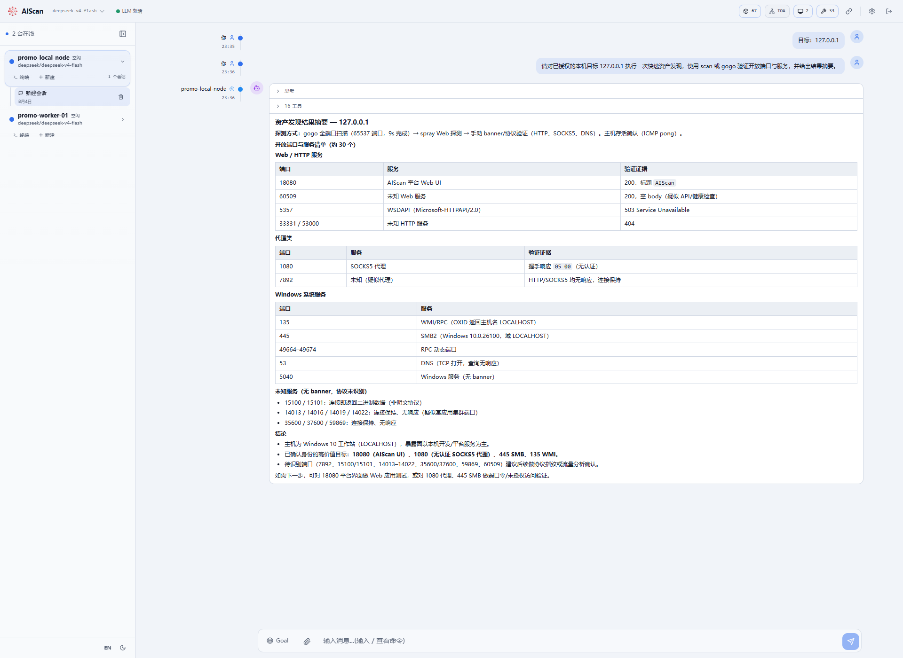
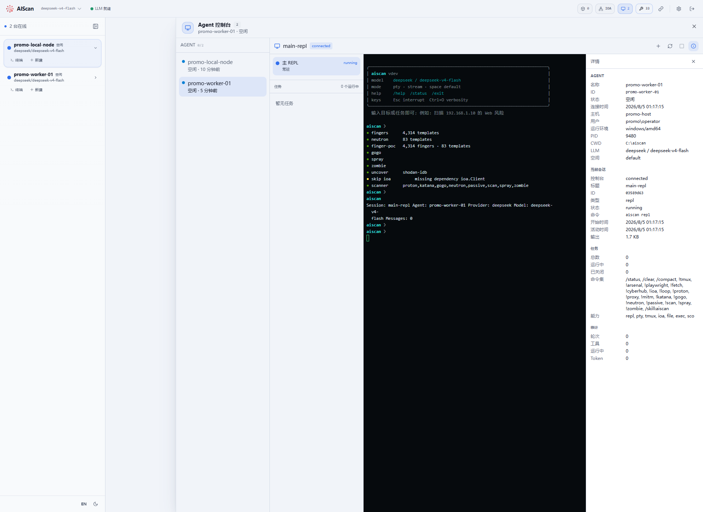
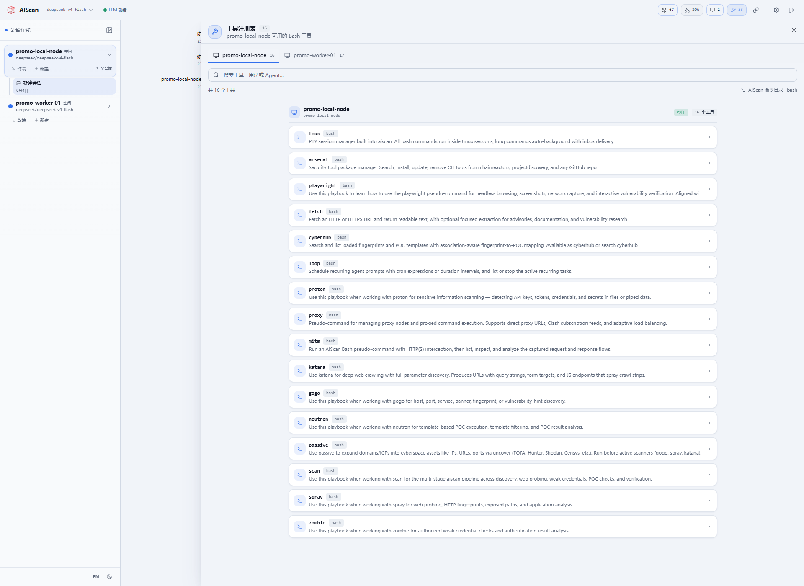
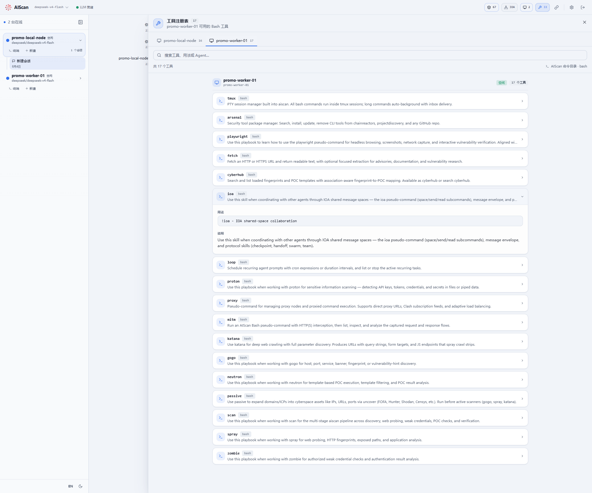

# AIScan 宣发文案与截图素材

## 核心定位

**AIScan：把安全扫描器、AI Agent 和分布式执行节点，收进一个 Web 工作台。**

从一句自然语言任务开始，AIScan 可以自主选择扫描工具、执行验证、汇总证据；需要扩展覆盖范围时，把新的 Agent Node 接入 Hub，节点能力和工具目录会自动上线；需要加入新能力时，实现统一 Tool 接口并注册，即可进入 Agent 的工具体系。

## 一段式宣发文案

AIScan 不只是“给扫描器接一个大模型”。它把 Web 操作台、Agent 执行节点、传统安全引擎和可扩展工具注册表组合成一套完整工作流：在浏览器中输入目标与任务，Agent 自主调用 gogo、spray、playwright 等工具完成发现、验证和总结；执行节点可以从本机或远程主机接入，统一呈现在线状态、终端、任务和运行能力；每个节点还会自动上报自己的工具目录，让工具可搜索、可查看用法、可按节点管理。扫描能力不再被固定流程锁死，而是能够随节点和 Tool 持续扩展。

## 三个核心卖点

### 1. Web 开箱即用：从任务到证据都在一个界面

启动 Web 控制台后，用户可以直接在浏览器里创建会话，用自然语言描述安全任务。Agent 会把端口发现、Web 探测、协议验证和结果整理串联起来，并在同一会话内展示思考过程、工具调用和结构化结论。

本次截图使用已授权的本机目标 `127.0.0.1` 做真实验证。AIScan 完成全端口发现后继续进行 Web 与协议探测，并成功识别运行在 `127.0.0.1:18080` 的 AIScan Web UI，返回 HTTP 200 和页面标题证据。本次本机环境中，全端口发现约 9 秒完成；该数字只代表本次演示环境，不作为通用性能基准。



推荐配图标题：

> 输入一个目标，AIScan 自主完成发现、验证与总结。

推荐配图说明：

> 对授权本机目标 `127.0.0.1` 的真实测试：从全端口发现到 Web 证据验证，结果直接回到 Web 会话。

### 2. AIScan 作为 Node 上线：把算力和能力接入同一个 Hub

AIScan Web 可以同时作为 Hub 使用。除了内嵌本地 Agent，还可以从其他主机接入独立执行节点。节点上线后，Web 会统一展示连接状态、运行环境、主 REPL、任务队列、命令集和能力集合，并提供远程终端与任务控制。

演示中同时上线了 `promo-local-node` 和 `promo-worker-01` 两个 Agent。独立 Worker 上报了 `repl`、`pty`、`tmux`、`ioa`、`file`、`exec`、`sco` 等能力，Hub 可直接观察节点状态和会话生命周期。

截图中的远程 Terminal 已实际绑定 `main-repl` 并执行 `/status`，终端输出、节点信息和能力详情均来自真实交互链路。



推荐配图标题：

> 节点一上线，执行环境、终端和能力立即可见。

推荐配图说明：

> AIScan 不局限于单机运行。把不同主机接入同一个 Hub，即可形成可观察、可调度的 Agent 执行网络。

接入示例：

```bash
# Hub：只启动 Web 与调度服务
aiscan-full web --addr 0.0.0.0:8080 --token change-me --no-agent

# Worker：从任意授权主机接入
aiscan agent --server-url http://change-me@server.example:8080 \
  --node-name worker-01
```

### 3. Tool 管理与扩展：能力随节点自动注册

每个 Agent Node 都会向 Hub 上报自己的 Bash 工具目录。Web 工具注册表按节点展示工具数量，支持搜索，并直接呈现工具用途、调用格式和说明。不同节点可以拥有不同工具集，Hub 不需要假设所有执行环境完全一致。

演示中两个节点分别上报 16 和 17 个工具，共 33 个节点工具实例；远程 Worker 额外注册了 IOA 协作工具，清楚展示了“能力跟随节点上线”的扩展方式。





推荐配图标题：

> 工具不是写死在界面里，而是由在线节点动态上报。

推荐配图说明：

> 同一个 Hub 可以管理不同节点、不同工具集。工具名称、用途和调用方式统一进入注册表，Agent 与使用者都能按需发现。

原生 Tool 的最小扩展模型也很直接：实现 `core/tool.Tool`，再显式注册到 `CommandRegistry`。只有在需要扫描引擎、IOA Client、Provider 或工作目录等共享运行时依赖时，才需要使用 Factory。

```go
type Tool struct{}

func (Tool) Name() string        { return "echo" }
func (Tool) Description() string { return "Return text unchanged." }

func Register(reg *commands.CommandRegistry) {
    reg.RegisterTool(Tool{})
}
```

## 社交媒体短文案

### 版本 A：产品发布风格

AIScan Web 现在可以把扫描、Agent 和执行节点放进同一个工作台。

输入目标，Agent 自主完成端口发现、Web 探测、协议验证和结果总结；接入新的 AIScan Node，终端、任务、运行能力和工具目录自动上线；扩展新 Tool，只需实现统一接口并注册。

这次用授权本机 `127.0.0.1` 做了真实验证：AIScan 从全端口发现一路定位并确认了自己的 Web UI。不是演示数据，是实际执行链路。

### 版本 B：更短、更适合配四张图

一句话发起扫描，一个 Web 管理所有 Agent。

- `127.0.0.1` 真实目标验证：发现、探测、证据、总结闭环
- AIScan Node 随时接入：状态、终端、任务、能力统一可见
- Tool 随节点注册：可搜索、可查看用法、可独立扩展

AIScan 正在把“扫描工具集合”变成一套可扩展的 AI 安全执行平台。

### 版本 C：技术社区风格

AIScan 的重点不是让 LLM 直接猜漏洞，而是让 Agent 在受控工具链上执行：传统扫描器负责确定性发现，浏览器与协议工具负责验证，LLM 负责规划、组合和总结。

Web Hub 管理会话与节点，Agent Node 上报运行能力和工具目录，Tool 通过统一接口扩展。单机可以开箱即用，多节点可以继续横向扩展。

## 四张图的发布顺序

1. `01-web-127-scan-verified.png`：先证明 Web 工作流和真实目标验证。
2. `02-agent-node-online-details.png`：展示 AIScan 作为独立 Node 上线。
3. `03-tool-registry-multi-node.png`：展示多节点工具集中管理。
4. `04-tool-extension-node-specific.png`：用节点专属 IOA 工具说明扩展机制。

## 素材说明

- 截图由 Playwright 对本地运行中的 AIScan Web 实例实际操作生成。
- 测试目标仅为已授权的本机 `127.0.0.1`。
- Node 详情截图中的主机名、用户名和工作目录已在截图阶段替换为演示信息。
- Web 验证截图已完整保留任务、探测结果分类和结论；本机主机名已替换为演示信息。
- 对外发布时建议保留“仅用于合法授权测试”的说明。
