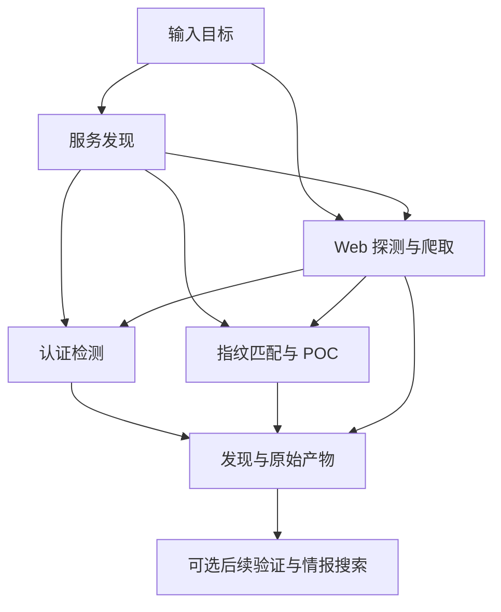

# 安全扫描

[使用者指南](user/README.md) · 前一篇：[Skills 与知识](user/knowledge.md) · 下一篇：[Web 与协作](user/web.md)

`scan` 将多个扫描引擎连接成规则驱动的流水线。从输入目标开始，发现的服务、Web 资产和指纹决定后续工作。规则扫描无需模型；需要 AI 时，可以对发现做后续验证或搜索补充情报。

## 开始扫描

对你有权测试的本地靶场执行：

```sh
aiscan scan -i http://127.0.0.1:3000 --verify=off -o lab-scan.jsonl
```

URL 直接进入 Web 探测；IP、IP:port 和 CIDR 会按目标类型进入服务发现或相应探测。可以重复 `-i`，或用 `-l targets.txt` 从每行一个目标的文件读取。扫描会产生主动探测，也可能包含认证检测。

执行时观察发现与错误，完成后读取汇总。没有发现可能来自目标不可达、规则未匹配或引擎不可用，不能直接解释为不存在风险。

## 扫描流程

流水线将工作拆成接受特定事件的能力。gogo 发现 HTTP 服务后，spray 探测页面与指纹；可认证服务进入弱口令检测；指纹再用于选择 neutron POC。爬取结果也可以进入后续探测。输入 URL 可以直接进入 Web 分支，无需重新遍历完整端口发现。



各阶段通过事件队列连接，可以交错执行。流水线建立时检查路由是否形成有向无环图，运行时按路由与目标键去重；同一目标仍可被不同能力处理。结束需要等待队列和在途工作全部排空，而不是第一个引擎返回就退出。

引擎是否安装、资源是否加载都会影响可用能力。需要观察调度时使用 `--trace`；`--debug` 还启用底层扫描器日志。装配与路由实现分别见[扫描能力](../tools/scan/capability.go)和[流水线](../tools/scan/pipeline/pipeline.go)。

## 扫描模式

默认 `quick` 包含服务发现、Web 探测、爬取、认证检测及按指纹选择的 POC。`full` 增加 common、bak、active 插件和默认字典路径探测，并将默认端口范围从资源定义的 `all` 改为 `-` 全端口。更大范围意味着更多请求和更长时间。

```sh
aiscan scan -i 127.0.0.1 --ports 80,443,3000 --verify=off
aiscan scan -i http://127.0.0.1:3000 --mode full --verify=off
```

扫描模式 full 和发行版 aiscan-full 是两个选择。完整发行版另外编译 Katana：quick 加入普通爬取，full 再加入浏览器深度爬取。浏览器爬取仍依赖可用的浏览器运行环境，不能等同于 `--deep` 的 AI 动态测试。

## 规则与资源

端口集合、指纹、字典和 POC 影响实际覆盖范围。`--ports` 可以指定资源中的端口集合或明确列表；`--dict`、`--rule` 和 `--word` 调整 Web 路径生成。`--user`、`--pwd` 和 `--zombie-top` 调整认证检测的候选凭据。

neutron 默认根据识别到的指纹选择模板，并受每个指纹的模板上限约束。`--broad-poc` 允许没有指纹匹配时也运行模板，会扩大工作量。扫描结论应保留所用资源和范围，方便后续复核。具体参数见[扫描参数参考](reference.md#scan-参数)，资源配置见 [Cyberhub](reference.md#cyberhub-资源)。

## 并发与超时

`--thread` 是各引擎容量的缩放基准，不是所有活动连接的总硬上限。当前分配为 gogo 80%、spray 10%、zombie 10%、neutron 10%，合计 110%；各能力还依据单次调用的线程数计算 worker 数量。

例如默认基准 1000 对应 gogo 容量 800、spray 100。gogo 单次默认最多 500 线程，spray 单次默认最多 20；实际活动量还取决于就绪目标和引擎。需要降低压力时同时缩小目标范围、并发与探测范围，不要把 `--thread 1000` 当作连接数严格不超过 1000 的保证。

`--timeout` 是单个探测的超时秒数，默认 5，不限制整条流水线的总时长。Agent 通过 bash 启动扫描时，还会受到该工具的运行期限约束，见[工具与环境](user/tools.md)。

## AI 增强扫描

显式使用 `--verify=low|medium|high|critical` 时，CLI 要求可用的模型，规则流水线完成后对达到阈值的发现运行验证。验证结果应与原始发现一起阅读；模型判断无法替代证据。

```sh
aiscan scan -i http://127.0.0.1:3000 --verify=high
aiscan scan -i http://127.0.0.1:3000 --verify=off --sniper
```

`--sniper` 在流水线之后针对已识别指纹搜索公开漏洞情报，也要求模型。已知 CVE 与目标实际受影响是两个判断，需要结合版本、配置和验证结果。

当前源码有几个与旧文档不同的边界。默认配置中的 `auto` 允许 Provider 不可用，但 CLI 会移除这个参数，扫描命令没有进一步将其转换为 high 阈值；因此目前不能承诺“默认自动验证 high”。显式传 `--verify=auto` 还会进入要求模型的启动路径。需要确定性地启用或关闭验证，请明确指定级别或 off。

`--deep` 仍在帮助和启动选项中，但当前 scan 执行路径没有调用 AI deep 阶段；不应将传入该参数当作已经完成动态测试。它也不控制完整发行版的 Katana 深度爬取。实现依据是[模式选择](../pkg/runner/scanner.go)、[启动入口](../pkg/runner/modes.go)和[扫描执行](../tools/scan/command.go)。

## 输出格式

终端默认随工作推进显示发现，结束时显示汇总。`--no-color` 关闭颜色；需要保存终端文本时使用 shell 重定向。

`-j` 在扫描完成后输出 gogo 与 spray 的原生 JSON Lines，适合消费这两类结果的程序。它不是全部漏洞、弱口令和验证结果的统一导出格式，也不是可以直接恢复的会话历史。

`-o` 保存实际发出的 AOP 事件和结构化产物到新文件。回放只读取记录，不重复探测：

```sh
aiscan -F lab-scan.jsonl
aiscan -F lab-scan.jsonl --view-format markdown -f lab-scan.md
```

`-f` 是回放的渲染文件。当前 scan 参数解析器没有 `--report`，需要 Markdown 时使用上述回放渲染入口；得到的是事件记录的可读版本，不是额外一次模型审计报告。事件、原生产物与 Web 资产的关系见[事件与数据](architecture/data.md)。

## 与 Agent 配合

已知要执行哪些探测时，直接扫描可以固定范围与参数。需要根据结果继续调查时，可以打开 Agent，让模型结合工具与知识推进；单扫描器的 `--ai` 入口见 [Agent 指南](agent.md#agent-与扫描)。

无论采用哪种入口，都应分别保存扫描发现、验证结论和未覆盖范围。原始证据与最终自然语言回答承担不同职责。
